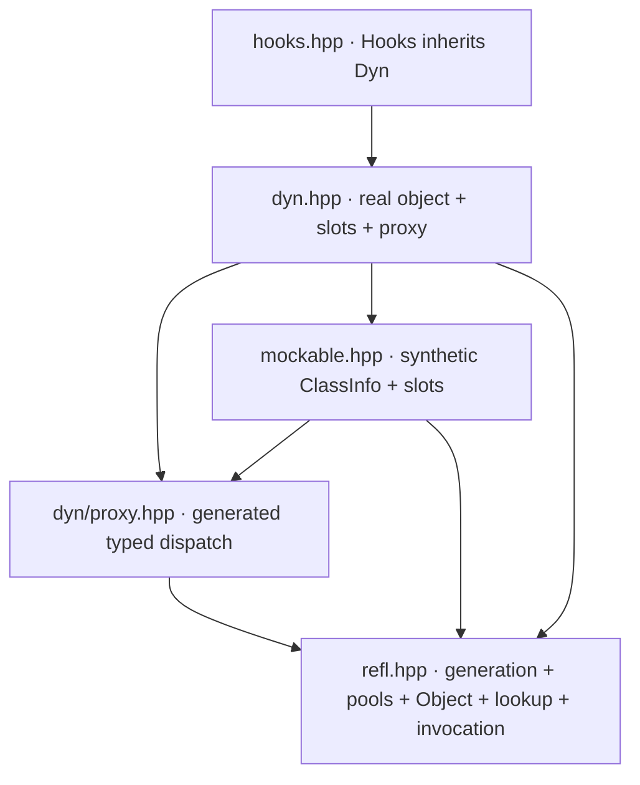

# Repository assessment

The strongest existing separation is `Proxy<T>` versus `Mockable<T>`: structural
binding is useful independently of replacement. Preserve that distinction and
make it visible in the public architecture. The largest pressure point is the
shared semantic contract underneath them, currently distributed across headers.

This is a static architecture review of revision `29ddfd2`, including headers,
samples, tests, Meson configuration, and existing documentation. It does not claim
that the C++ suite was executed or that every implementation defect was identified.
Source links below pin the reviewed revision so future refactoring does not erase
the evidence behind the recommendations.

## What exists

These are header dependencies, with a few redundant edges omitted. The public
“two layers” description hides both reusable components and an optional extension.

| Evidence in this revision | Architectural consequence | Direction |
| --- | --- | --- |
| [`refl.hpp`](https://github.com/swuerl/cpp_runtime_reflection/blob/29ddfd2/include/refl/refl.hpp): `RegistrarHolder::make_info`, global pools, `Object`, hierarchy helpers, and public handles share one header | Compiler reflection, process policy, and runtime semantics cannot be consumed independently | Extract contracts first, then generation and runtime services |
| Same header: `normalize_type` lowercases and removes qualifiers, while `extract_arg` compares display names and performs upcasts | Lookup identity and invocation compatibility answer different questions through string conventions | Give identity, complete signatures, and compatibility separate representations |
| Same header: `Object` owns `ClassInfo`; `Class`, `Function`, and `Field` hold raw metadata pointers | Handle validity depends on where metadata came from; synthetic metadata is not necessarily process-lived | Handles retain immutable descriptor storage |
| [`proxy.hpp`](https://github.com/swuerl/cpp_runtime_reflection/blob/29ddfd2/include/refl/dyn/proxy.hpp): `populate` resolves structure and `TypedMethod` builds its own argument storage | Typed calls can diverge from core forwarding and resolution semantics | Produce a binding plan and reuse the call-frame contract |
| [`mockable.hpp`](https://github.com/swuerl/cpp_runtime_reflection/blob/29ddfd2/include/refl/mockable.hpp): synthetic `T$mock` metadata, name-keyed slots, raw `ctx`, and `proxy()` convenience | Interface identity, storage identity, overload selection, and adapter dependency are intertwined | Separate interface from storage; key slots by member identity; own callable context |
| [`dyn.hpp`](https://github.com/swuerl/cpp_runtime_reflection/blob/29ddfd2/include/refl/dyn.hpp): `wire_real_slots`, `restore`, `wrap`, and mode transitions coordinate several stores and pointers | Lifetime and transition correctness depend on each operation remembering every related store | Publish complete backend states and compose owned call targets |
| [`hooks.hpp`](https://github.com/swuerl/cpp_runtime_reflection/blob/29ddfd2/include/refl/hooks.hpp): derived class reaches `mockable_`; callbacks and saved property contexts live in separate maps | Observation is coupled to dynamic storage layout and wrapper lifetime | Observed endpoint adapter outside replacement chains, plus connection tokens |
| [`tests/meson.build`](https://github.com/swuerl/cpp_runtime_reflection/blob/29ddfd2/tests/meson.build) registers `selfcheck`, `test_refl`, and `test_dyn`, but not existing `test_mockable.cpp` or `test_hooks.cpp` | A successful default test run does not cover all architectural components | Make each public layer a first-class build/test target |

## Keep these strengths

The current `Object` already separates a storage owner from the address being
viewed. That is the right starting point for base subobjects and retained field
references. Extend it with explicit constness and lifetime provenance.

The runtime exposes handles rather than asking users to manipulate metadata
vectors directly. Preserve that API shape while moving the metadata behind an
internal, immutable representation.

[`samples/proxy.cpp`](https://github.com/swuerl/cpp_runtime_reflection/blob/29ddfd2/samples/proxy.cpp)
demonstrates the central product feature: unrelated `Square` and `Triangle` types
bound to the same declaration-only `IDrawable` interface. Promote this to an
architectural acceptance scenario.

The core tests already exercise inheritance, ambiguity, ownership, and reference
behavior; the proxy tests include failed rebinding and moved-from behavior. Use
these scenarios as seeds for contracts shared across layers, while reviewing
whether each expectation is intended behavior or a historical limitation.

## Decisions in priority order

1. Define identity and complete signatures before expanding overload support.
   Otherwise every new adapter inherits lossy matching rules.
2. Define storage, reference, and callable ownership before expanding reset,
   wrapping, or cross-object observation. These are graph-lifetime decisions.
3. Centralize resolution and argument binding before adding more dispatch syntax.
   A typed view must preserve the semantics of the object it exposes.
4. Separate metadata construction from registry publication. Local registries and
   synthetic backends should not need global mutable state to behave correctly.
5. Make hooks an optional consumer of invocation endpoints and checked runtime
   calls, with explicit delivery and disconnection rules. Keep Dyn integration
   separate from the observation adapter.

The [recorded baseline](migration.md#recorded-baseline-limitations) adds execution
evidence from the subsequent documentation review at `7eb6bbe`. It distinguishes
passing core tests from build failures and unregistered tests; it does not change
the revision or static-review scope of the source assessment above.

## Documentation drift is a boundary signal

The existing Dyn page places `connect` and `on_change` on `Dyn`, while the source
places them on `Hooks`; it calls `Dyn` non-movable while the source declares move
operations. It also describes dispatch features that the current proxy no longer
exposes, such as property subscripting and static dispatch fields. The core design
page contains conflicting accounts of inheritance hiding and metadata ownership.

These discrepancies are evidence that the conceptual model has not kept pace
with component changes. This section provides a proposed architecture, not a
replacement API reference. During migration, align each existing API page and
sample with its owning layer and verify examples before presenting them as current.

Continue with [contracts and values](contracts.md).
