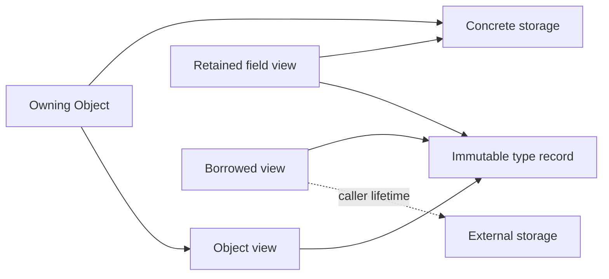

# Layer 1: Core contracts

This layer defines the language spoken by generation, runtime lookup, proxies, and
slots. It depends only on the standard library. Its non-template runtime surface
must not require `<meta>`, global pools, or an adapter header.

Proposed home: `refl/core/{type,descriptor,value,call,error}.hpp`. These are logical
boundaries; combine small headers where that improves readability.

## Identity is not presentation

Use `*Descriptor` for immutable native metadata, such as `TypeDescriptor`,
`ClassDescriptor`, `FunctionDescriptor`, and `FieldDescriptor`. Use `*Handle` for
retained access to that metadata: `TypeHandle`, `ClassHandle`, `FunctionHandle`,
and `FieldHandle`. An `InterfaceSchema` describes structural requirements;
`InterfaceHandle` retains that schema. `SchemaHandle` retains the callable surface
of either a native descriptor or an interface schema without claiming native
storage identity. These names distinguish metadata from the objects it describes.

```cpp
// Target sketch: abbreviated records, not a complete declaration set.
struct TypeId { /* opaque identity within one program */ };
struct TypeUse { TypeId type; Cv qualifiers; ReferenceKind reference; };
struct MemberId { TypeId declaring_type; unsigned declaration_index; };

struct Signature {
    std::vector<TypeUse> parameters;
    TypeUse result;
    ReceiverQualifiers receiver;   // const/volatile and &/&&
    bool is_noexcept;
};
```

`TypeId` equality means the same C++ type in the supported program configuration.
An inline per-type token is one possible implementation; it is not a cross-DSO
identity guarantee. Explicitly named external IDs can be added later at a boundary.
Compiler display names remain case-sensitive diagnostic text and registry aliases.

Represent pointer and array structure in type descriptors: `const int*` and
`int* const` must remain distinct. `TypeUse` carries top-level qualification and
reference binding without collapsing the underlying type. `MemberId` identifies
a declaration, including its declaring type; a name alone identifies an overload
set. Declaration indices are not stable persistence keys.

| Question | Representation |
| --- | --- |
| Which exact type is this? | `TypeId` |
| What shall an error print? | Display name |
| What does a user search for? | Registered name or explicit alias |
| Which overload/declaration is replaced? | `MemberId` |
| Can these arguments bind? | `Signature` plus argument views |
| Does an implementation satisfy an interface? | Explicit structural compatibility predicate |

Return type is part of the contract, although C++ does not overload on return type
alone. Receiver qualifiers and `noexcept` must be retained even where the first
version explicitly rejects a combination.

## Distinguish storage ownership from access

```cpp
struct ObjectView {
    const void* address;
    TypeHandle type;               // retains immutable type metadata
    Access access;                 // read-only or mutable
    LifetimeAnchor anchor;         // optional owner of the referent
};

struct ArgumentView {
    ObjectView object;
    ValueCategory category;        // lvalue or consumable rvalue
};
```

`Object` owns concrete storage and exposes an `ObjectView`. An `ObjectView` is
possibly retained: its optional anchor can keep storage alive, while an unanchored
view is a borrow. `own(value)` creates an `Object`; `borrow(x)` and
`borrow_const(x)` create unanchored views. Passing an object or view to a call does
not change its category or constness. Compatibility behavior is specified in the
[migration guide](migration.md#compatibility-is-an-explicit-translation).

| Result | Storage/lifetime contract |
| --- | --- |
| `int` or another value | Own result storage; allow move extraction |
| `void` | Explicit successful `VoidResult` |
| Reference into an owned receiver | Retain receiver storage and metadata |
| Reference into an argument | Retain that argument's anchor when available |
| Reference into a replacement closure | Retain the selected target's context owner |
| Reference to external storage | Explicit borrow; caller must keep storage alive |
| Const reference or const field view | Preserve read-only access through every cast |

A return type such as `T&` does not reveal the referent's owner. Generation must
not infer “owned by receiver” from reference syntax alone. Default unknown
references to borrows; allow a registration policy to assert receiver, argument,
callable-context, or external lifetime. A target may instead supply an explicit
result anchor when the owner depends on the call. Reject exporting a reference
into call-frame temporary storage unless its backing storage is retained.
The initial runtime rejects unannotated reference calls involving temporary
arguments before entering the target.

Callable-context provenance retains the context of the target actually invoked,
including an inner target when a decorator forwards its result. It must not retain
whichever replacement happens to occupy the slot after the call. For example, a
retained reference into a closure remains backed after that closure is replaced;
a typed `T&` alone does not carry that owner to the caller.

### Exporting a reference to the caller

Result provenance and permission to discard its anchor are separate capabilities.
Initially, ordinary typed `T&` and `const T&` returns require an explicit
`caller_borrow` policy: the caller must independently keep the referent alive and
address-stable throughout the call, synchronous observation, and subsequent use.
This can describe an independently retained native receiver, a caller-owned lvalue
argument, or external storage. The framework checks the declared policy and argument
category; the caller remains responsible for fulfilling that lifetime assertion.

Receiver-, argument-, or callable-context anchors alone do not grant this
capability. Such results require retained extraction. Unknown provenance cannot
be exported as a raw typed reference initially. Validate this restriction against
the selected target before entering user code on every typed reference call, so
replacement cannot bypass it. Structural binding may still succeed for a member
whose reference result is available only through retained extraction.

The proposed `try_call_retained<T>(source, member, args...)` returns
`Result<RetainedRef<T>>`. `RetainedRef<T>` holds the referent address, metadata,
access capability, and the actual result anchor; `get()` returns `T&` while the
handle is retained. A const result requires `RetainedRef<const T>`. Reject a known
unanchored policy before invocation; if a policy supplies its anchor dynamically,
check the returned anchor before export and report a result-capture failure if it
is absent. Never substitute the current slot owner for the invoked target's owner.
Runtime calls returning `ObjectView` retain the same anchor without typed extraction.

For example, a listener can replace a closure after it returns a reference into
itself. Call-scoped ownership keeps that reference alive during delivery, but
releasing the last owner on return would leave an ordinary `T&` dangling. Reject
that ordinary typed call before invocation; the retained operation keeps the old
closure alive after delivery and replacement. Capturing a generation alone does
not solve this, because its slots can still be replaced.

An anchor extends ownership, not address stability. Keeping a receiver alive does
not preserve references into its vector after reallocation or into an erased
element. Views follow the referent's ordinary mutation and invalidation rules.
This also applies during reentrant observer delivery before a call returns; use
an owning copy when a stable value is required and copying is supported.



Descriptors describe types and members. Instances own storage. Interface schemas
describe callable requirements. A backend context is not a concrete instance of
the interface type, so structural conformance never authorizes `cast<T>()`.

## One call contract

```cpp
using CallResult = std::variant<VoidResult, Object, ObjectView>;
using InvokeFn = Result<CallResult> (*)(void* context, CallFrame& frame);

class CallTarget;  // opaque retained value, produced by validated factories
```

`CallTarget` retains an immutable invocation contract: complete signature and
operation kind, erased thunk and owned context, any bound receiver and its anchor,
result provenance/export policy, and declared native dependencies. These may live
in shared internal records; the public API does not expose writable raw pointers.
Generated native factories and signature-aware callable factories establish the
contract. Registration options name `result_lifetime` (receiver, argument index,
`callable_context`, or external) separately from `reference_export` (restricted by
default, or explicitly `caller_borrow`). `native_dependency` defaults to unknown;
`independent` is an explicit caller assertion. Per-call result anchors may refine
ownership but cannot silently grant raw reference-export permission. Raw thunk
construction is an internal backend boundary whose author must prove the same invariants.

Installing an erased target compares its retained contract with the destination
operation, including receiver access, signature, result policy, and capabilities.
An incompatible target fails before publication and leaves the old target intact.
A saved native target retains its adjusted receiver and concrete storage independently
of the live provider. Restoring it after reset must never silently bind it to the
new receiver. Decorators retain the previous target's receiver and result provenance
when forwarding its result, and combine its dependencies with their own.

`CallFrame` holds a receiver view, a span of argument views, and any temporary
storage needed until completion. Runtime handles and typed wrappers construct the
same frame. One validator checks receiver capability, arity, type compatibility,
and value category before the target runs. Unsupported implicit conversions fail
before user code runs. A fast path may reuse a validated binding plan, but must
preserve those checks that depend on the actual call.

The context owner in `CallTarget` keeps the context alive, not necessarily the returned
reference. Result provenance is a separate concern. Ordinary native functions can
use a stateless thunk; a replacement can retain a closure; a decorator retains its
previous `CallTarget`.

Use structured diagnostics: code, member identity, expected/actual type use, and
argument index where relevant. Distinguish library validation errors from target
exceptions. The proposed default returns validation failures through `Result` and
lets target exceptions propagate unchanged. A typed convenience call can translate
a validation error into `ReflectionError`; a `try_call` exposes the same diagnostic.
Do not promise a completely non-throwing API unless a separate policy also defines
allocation failure and target-exception handling.
Argument preparation, erased result capture, and typed result extraction can also
throw, including from user-defined copy/move operations. Document these stages
separately from validation and target execution; a failure after target entry does
not imply the target had no effects. Observation's completion boundary is defined
in its [delivery contract](observation.md#delivery-contract).

## Dispatch handles and resolved calls

```cpp
// Target sketch: a retained selection for one call.
struct ResolvedCall {
    CallTarget target;
    ObjectView receiver;           // adjusted native view or backend storage view
    Signature signature;
    LifetimeAnchor state_owner;    // retains the selected state through completion
};
```

A `DispatchHandle` retains a provider with a callable schema and an operation
that resolves a member plus operation kind into a `ResolvedCall`. Resolution
selects state; it does not invoke user code. The runtime's checked invocation
service validates and invokes the resolved call using the common frame. Dispatch
contracts need neither compiler reflection nor knowledge of `Dynamic` or observers.
This is a small erased protocol, not a requirement for a virtual class hierarchy.

A native dispatch handle resolves operations on a retained object. A dispatch table
resolves the current target on a retained state. A live `DispatchHandle` follows
published state changes, whereas a captured binding keeps its selected generation.
The handle's schema describes callable requirements; its receiver view describes
actual storage. Structural conformance never changes the receiver's native cast
identity.
A dispatch handle preserves its advertised schema across its lifetime. Publishing
a new dynamic state must validate that schema before existing proxies can use it.

Keep each `ResolvedCall` alive through invocation, result extraction, and synchronous
observation. A result escaping that interval needs its own declared anchor.
The resolved call's owners establish lifetime and reentrancy behavior; they do not
provide synchronization for concurrent state mutation.

## Acceptance boundary

Prove that a mock descriptor can be created and invoked without reflection syntax.
Exercise one call matrix through both runtime and typed entry points: mutable
out-parameters update the caller, const borrows cannot become mutable, move-only
values require consumption, and a void success differs from an invalid receiver.
Retain a member handle after releasing its originating registry or synthetic
backend and verify that metadata access remains valid.

Next: [reflection and descriptor generation](generation.md).
