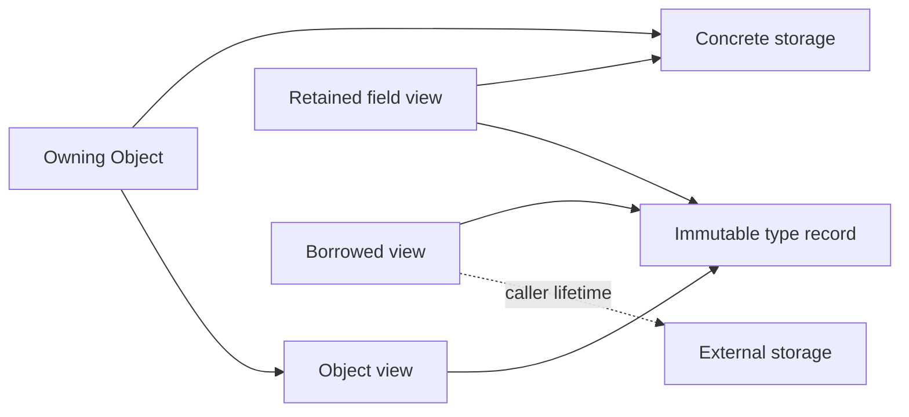

# Layer 1: Contracts and values

This layer defines the language spoken by generation, runtime lookup, proxies, and
slots. It depends only on the standard library. Its non-template runtime surface
must not require `<meta>`, global pools, or an adapter header.

Proposed home: `refl/core/{type,descriptor,value,call,error}.hpp`. These are logical
boundaries; combine small headers where that improves readability.

## Identity is not presentation

```cpp
// Target sketch: abbreviated records, not a complete declaration set.
struct TypeId { /* opaque identity within one program */ };
struct TypeUse { TypeId type; Cv qualifiers; ReferenceKind reference; };
struct MemberId { TypeId declaring_type; unsigned declaration_index; };

struct Signature {
    std::vector<TypeUse> parameters;
    TypeUse result;
    ReceiverQualifiers receiver;   // const/volatile and &/&&
    bool is_noexcept;
};
```

`TypeId` equality means the same C++ type in the supported program configuration.
An inline per-type token is one possible implementation; it is not a cross-DSO
identity guarantee. Explicitly named external IDs can be added later at a boundary.
Compiler display names remain case-sensitive diagnostic text and registry aliases.

Represent pointer and array structure in type descriptors: `const int*` and
`int* const` must remain distinct. `TypeUse` carries top-level qualification and
reference binding without collapsing the underlying type. `MemberId` identifies
a declaration, including its declaring type; a name alone identifies an overload
set. Declaration indices are not stable persistence keys.

| Question | Representation |
| --- | --- |
| Which exact type is this? | `TypeId` |
| What shall an error print? | Display name |
| What does a user search for? | Registered name or explicit alias |
| Which overload/declaration is replaced? | `MemberId` |
| Can these arguments bind? | `Signature` plus argument views |
| Does an implementation satisfy an interface? | Explicit structural compatibility predicate |

Return type is part of the contract, although C++ does not overload on return type
alone. Receiver qualifiers and `noexcept` must be retained even where the first
version explicitly rejects a combination.

## Distinguish storage ownership from access

```cpp
struct ObjectView {
    const void* address;
    TypeHandle type;               // retains immutable type metadata
    Access access;                 // read-only or mutable
    LifetimeAnchor anchor;         // optional owner of the referent
};

struct ArgumentView {
    ObjectView object;
    ValueCategory category;        // lvalue or consumable rvalue
};
```

An owning `Object` contains storage plus a view. A borrow contains a view with no
storage owner. Passing either to a call does not change its category or constness.
Named entry points such as `borrow(x)`, `borrow_const(x)`, and `own(value)` make
storage decisions visible; preserve implicit current constructors only as a
compatibility facade with documented behavior.

| Result | Storage/lifetime contract |
| --- | --- |
| `int` or another value | Own result storage; allow move extraction |
| `void` | Explicit successful `VoidResult` |
| Reference into an owned receiver | Retain receiver storage and metadata |
| Reference into an argument | Retain that argument's anchor when available |
| Reference into a replacement closure | Retain the selected target's context owner |
| Reference to external storage | Explicit borrow; caller must keep storage alive |
| Const reference or const field view | Preserve read-only access through every cast |

A return type such as `T&` does not reveal the referent's owner. Generation must
not infer “owned by receiver” from reference syntax alone. Default unknown
references to borrows; allow a registration policy to assert receiver, argument,
callable-context, or external lifetime. A target may instead supply an explicit
result anchor when the owner depends on the call. Reject exporting a reference
into call-frame temporary storage unless its backing storage is retained.
Conservative policy can reject unannotated reference signatures involving
temporary arguments initially.

Callable-context provenance retains the context of the target actually invoked,
including an inner target when a decorator forwards its result. It must not retain
whichever replacement happens to occupy the slot after the call. For example, a
retained reference into a closure remains backed after that closure is replaced;
a typed `T&` alone does not carry that owner to the caller.

An anchor extends ownership, not address stability. Keeping a receiver alive does
not preserve references into its vector after reallocation or into an erased
element. Views follow the referent's ordinary mutation and invalidation rules.
This also applies during reentrant observer delivery before a call returns; use
an owning copy when a stable value is required and copying is supported.



Descriptors describe types and members. Instances own storage. Interface schemas
describe callable requirements. A backend context is not a concrete instance of
the interface type, so structural conformance never authorizes `cast<T>()`.

## One call contract

```cpp
using CallResult = std::variant<VoidResult, Object, ObjectView>;
using InvokeFn = Result<CallResult> (*)(void* context, CallFrame& frame);

struct CallTarget {
    InvokeFn invoke;
    void* context;
    std::shared_ptr<void> context_owner;
};
```

`CallFrame` holds a receiver view, a span of argument views, and any temporary
storage needed until completion. Runtime handles and typed wrappers construct the
same frame. One validator checks receiver capability, arity, type compatibility,
and value category before the target runs. Unsupported implicit conversions fail
before user code runs. A fast path may reuse a validated binding plan, but must
preserve those checks that depend on the actual call.

The owner in `CallTarget` keeps the context alive, not necessarily the returned
reference. Result provenance is a separate concern. Ordinary native functions can
use a stateless thunk; a replacement can retain a closure; a decorator retains its
previous `CallTarget`.

Use structured diagnostics: code, member identity, expected/actual type use, and
argument index where relevant. Distinguish library validation errors from target
exceptions. The proposed default returns validation failures through `Result` and
lets target exceptions propagate unchanged. A typed convenience call can translate
a validation error into `ReflectionError`; a `try_call` exposes the same diagnostic.
Do not promise a completely non-throwing API unless a separate policy also defines
allocation failure and target-exception handling.

## Invocation endpoints and call snapshots

```cpp
// Target sketch: a retained selection for one call.
struct CallSnapshot {
    CallTarget target;
    ObjectView receiver;           // adjusted native view or backend storage view
    Signature signature;
    LifetimeAnchor state_owner;    // retains the selected state through completion
};
```

An `EndpointHandle` retains a provider with a callable schema and an operation
that resolves a member plus operation kind into a `CallSnapshot`. Resolution
selects state; it does not invoke user code. The runtime's checked invocation
service validates and invokes the snapshot using the common frame. Endpoint
contracts need neither compiler reflection nor knowledge of `Dyn` or observers.
This is a small erased protocol, not a requirement for a virtual class hierarchy.

A native endpoint resolves operations on a retained object. A slot endpoint
resolves the current target on a retained backend state. A live dynamic endpoint
follows published state changes, whereas a captured state endpoint keeps its
selected generation. The endpoint's schema describes callable requirements;
its receiver view describes actual storage. Structural conformance never changes
the receiver's native cast identity.
An endpoint preserves its advertised schema across its lifetime. Publishing a new
dynamic state must validate that schema before existing bound views can use it.

Keep each snapshot alive through invocation, result extraction, and synchronous
observation. A result escaping that interval needs its own declared anchor.
Snapshot ownership establishes lifetime and reentrancy behavior; it does not
provide synchronization for concurrent state mutation.

## Acceptance boundary

Prove that a mock descriptor can be created and invoked without reflection syntax.
Exercise one call matrix through both runtime and typed entry points: mutable
out-parameters update the caller, const borrows cannot become mutable, move-only
values require consumption, and a void success differs from an invalid receiver.
Retain a member handle after releasing its originating registry or synthetic
backend and verify that metadata access remains valid.

Next: [reflection generation](generation.md).
