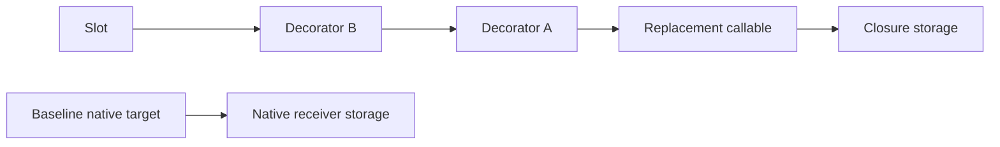
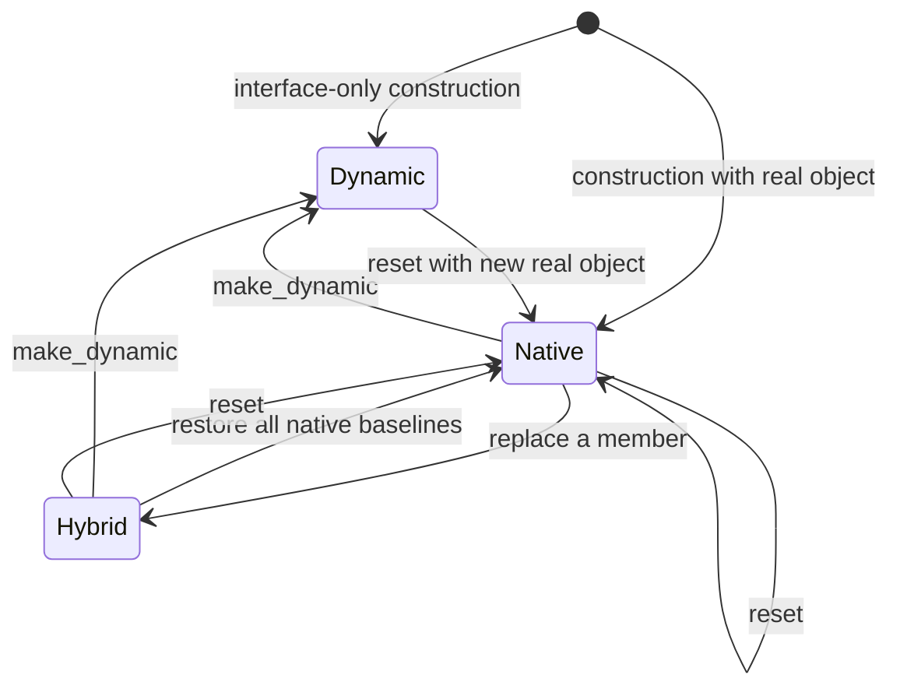

# Layer 5: Dynamic composition

Keep two concepts: a slot backend supplies replaceable operations; `Dyn<T>` is a
convenience object combining that backend, an optional native instance, and a typed
view. Proposed homes are `refl/dynamic/{slots,dyn}.hpp`, with compatibility includes
at the current paths.

The backend depends on contracts and generated interface schemas. `Dyn` also uses
runtime binding and the proxy adapter. The backend must remain usable by a runtime
caller that never instantiates a typed proxy.

## Slots retain complete targets

```cpp
// Target sketch: member identity distinguishes overloads.
struct Slot {
    MemberId member;
    CallTarget baseline;            // optional native implementation
    CallTarget current;             // native, replacement, or decorator
};

auto previous = backend.target(render_member);  // owns its context
backend.replace(render_member, make_target(lambda)).value();
backend.replace(render_member, previous).value();
```

A saved target owns its callable and receiver context. Replacing a map entry must
not destroy a context still referenced by a saved target or an executing call.
Each invocation snapshots its current target before entering user code. This
also defines behavior when a callable replaces itself reentrantly.

A synthetic backend satisfies an interface; it is not an instance of that C++
interface. Keep separate storage identity and interface schema identity instead
of making `T$mock` carry both roles. Structural binding selects operations; native
casts inspect actual storage identity.

## Wrapping is owned composition



Each decorator owns the previous target and its own callable. `wrap(B)` after
`wrap(A)` produces `B(A(target))`. Restoring the baseline drops that chain from the
slot, while active snapshots remain valid. This model avoids saving an invoker
address in one place and keeping its context alive by convention elsewhere.

Give method and property operations the same ownership discipline. A property
target exposes separate read/write/view capabilities; replacing a setter does not
implicitly manufacture addressable storage or a copy getter.

If a callback needs `self`, provide a backend handle with an explicit lifetime
policy. Prefer a weak reference to the containing dynamic state to prevent a
state → slot → closure → state ownership cycle. Lock it when invoked and return
an expired-context diagnostic if unavailable. Do not retain a raw pointer to the
address of a movable facade as the semantic identity of the instance.

## Define mode transitions as state publication



| Operation | Proposed postcondition |
| --- | --- |
| Interface-only construction | Required slots exist but may be unimplemented |
| Construction with native object | Baselines and current targets refer to that owned object |
| `implement(member, fn)` | Only that exact member changes; signature validated |
| `restore(member)` | Restore native baseline; report unavailable baseline in dynamic mode |
| `wrap(member, fn)` | New owned decorator surrounds the current target |
| `make_dynamic()` | Drop native baselines and native-dependent targets; retain independent replacements |
| `reset(args...)` | Build a new native object and complete slot table; discard replacements/wrappers on success |

For `make_dynamic`, mark a wrapper chain's dependency on native storage explicitly.
If it cannot be detached safely, make the affected slot unimplemented. Never leave
a raw target pointing at the released native object. `reset` is transactional with
respect to dynamic state publication: construction/binding failure leaves the old
state. This does not undo external side effects in a constructor.

Already retained views and in-progress calls keep their old state alive after a
transition. Fresh calls through `Dyn` see the new state. Document that distinction
so reset does not appear to revoke references already given to callers.

Initially require external synchronization for concurrent mutation and invocation.
Immutable target snapshots define lifetime and reentrancy, but do not automatically
make the slot map thread-safe. State this separately from registry thread safety.

## Migration seam and proof

Introduce owned `CallTarget` into existing `MethodSlot`/`PropertySlot` machinery
before moving headers. Replace string keys with `MemberId`, then implement generic
signature-driven callable thunks instead of a separate handwritten arity branch in
every layer. Unsupported signatures must fail at registration or binding.

Prove overload isolation, save/replace/restore lifetime, nested wrapping order,
self-replacement during a call, failed reset, and transition to dynamic mode with
a mixture of native targets and independent replacements. A destruction counter
should demonstrate that saved targets retain exactly the contexts they need.

Next: [observation](observation.md).
