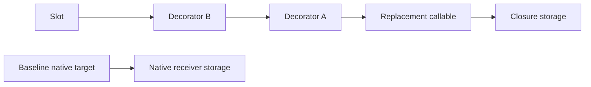
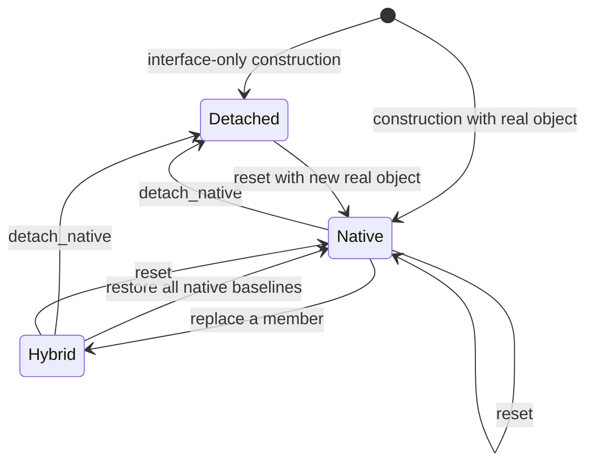

# Layer 5: Dynamic dispatch

`DispatchTable<Interface>` owns slots supplying replaceable operations.
`Dynamic<Interface>` combines a dispatch table, an optional native instance, and
a typed proxy. Proposed homes are `refl/dynamic/{dispatch_table,dynamic}.hpp`;
compatibility includes are listed in the migration guide.

The dispatch table depends on core contracts and generated interface schemas.
`Dynamic` also uses runtime binding and the proxy adapter. The dispatch table must
remain usable by a runtime caller that never instantiates a typed proxy.

The dispatch table implements the common dispatch-handle contract. `Dynamic`
provides a stable live handle whose state reference changes only after a successful
reset or detachment. Moving the facade transfers that handle identity. Proxies and
observers consume the handle without accessing slot containers directly.

`dynamic.dispatch()` returns a `DispatchHandle` that follows reset and detachment.
`dynamic.capture_binding()` returns a `Proxy<Interface>` bound to the current
generation. It sees replacements in that generation but does not follow later
state publication. These operations make the lifetime choice explicit at the call
site. `dynamic->member(...)` uses live dispatch.

## Slots retain complete targets

```cpp
// Target sketch: member identity distinguishes overloads.
struct Slot {
    MemberId member;
    CallTarget baseline;            // optional native implementation
    CallTarget current;             // native, replacement, or decorator
};

auto previous = table.target(render_member);  // owns its context
table.replace(render_member, make_target(lambda)).value();
table.replace(render_member, previous).value();
```

A saved target owns its callable and receiver context. Replacing a map entry must
not destroy a context still referenced by a saved target or an executing call.
Each invocation retains its selected target in a `ResolvedCall` before user code. This
also defines behavior when a callable replaces itself reentrantly.

A dispatch table satisfies an interface; it is not an instance of that C++
interface. Keep storage identity separate from interface schema identity.
Structural binding selects operations; native casts inspect actual storage identity.

## Wrapping is owned composition



Each decorator owns the previous target and its own callable. `wrap(B)` after
`wrap(A)` produces `B(A(target))`. Restoring the baseline drops that chain from the
slot, while active resolved calls remain valid. This model avoids saving an invoker
address in one place and keeping its context alive by convention elsewhere.

Give method and property operations the same ownership discipline. A property
target exposes separate read/write/view capabilities; replacing a setter does not
implicitly manufacture addressable storage or a copy getter.

If a callback needs `self`, provide a backend handle with an explicit lifetime
policy. Prefer a weak reference to the containing dynamic state to prevent a
state → slot → closure → state ownership cycle. Lock it when invoked and return
an expired-context diagnostic if unavailable. Do not retain a raw pointer to the
address of a movable facade as the semantic identity of the instance.

## Define mode transitions as state publication



| Operation | Proposed postcondition |
| --- | --- |
| Interface-only construction | Required slots exist but may be unimplemented |
| Construction with native object | Baselines and current targets refer to that owned object |
| `implement(member, fn)` | Only that exact member changes; signature validated |
| `restore(member)` | Restore native baseline; report unavailable baseline in detached mode |
| `wrap(member, fn)` | New owned decorator surrounds the current target |
| `detach_native()` | Drop native baselines and targets with native or unknown dependencies; retain declared independent replacements |
| `reset(args...)` | Build a new native object and complete slot table; discard replacements/wrappers on success |

For `detach_native`, track native dependencies on generated targets, replacement
registrations, and wrapper chains. A decorator inherits its previous target's
dependencies and declares any additional ones. Replacement registration supplies
owned contexts or lifetime anchors plus a dependency policy: native-dependent,
independent, or unknown. Unknown dependencies default to making the affected slot
unimplemented on detachment; explicitly independent replacements remain callable.

The framework cannot infer dependencies hidden in arbitrary lambda captures.
Marking a callable independent is a caller assertion, and capturing a borrowed
pointer leaves its lifetime with the caller. Offer explicit context ownership and
native-dependency declarations for captures the backend should manage. The
detachment guarantee covers these tracked dependencies; it cannot make an
incorrectly declared borrowed capture safe. Dropping targets from current slots
does not destroy contexts still owned by saved targets or active calls.

`reset` is transactional with respect to dynamic state publication:
construction/binding failure leaves the old state. This does not undo external
side effects in a constructor.

Captured bindings and in-progress calls keep their old generation alive after
a transition. A captured binding still sees replacements within that generation;
it does not follow a later reset. Fresh calls through `Dynamic` or its stable live
dispatch handle resolve the new generation. `Observed` adapters over that handle
also follow reset. This distinction concerns state ownership, not protection
against mutations that invalidate references inside a retained object.

Initially require external synchronization for concurrent mutation and invocation.
Retained resolved calls define lifetime and reentrancy, but do not automatically
make the slot map thread-safe. State this separately from registry thread safety.

## Implementation boundary and proof

Use owned `CallTarget` values for method and property operations in each dispatch
table. Key slots with `MemberId` and use generic signature-driven callable thunks.
Unsupported signatures must fail at registration or binding. The migration guide
records the existing stores and adapters that move behind this boundary.

Prove overload isolation, save/replace/restore lifetime, nested wrapping order,
self-replacement during a call, failed reset, and transition to detached mode with
a mixture of native targets and independent replacements. A destruction counter
should demonstrate that saved targets retain exactly the contexts they need.
Include declared native captures, unknown dependencies, closure-owned reference
results, and an old captured binding alongside live dispatch after reset.

Next: [call observation](observation.md).
