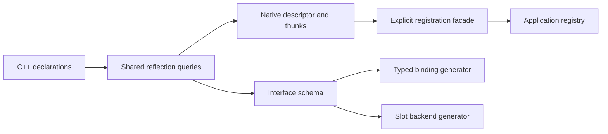

# Layer 2: Reflection generation

Generation translates C++ declarations into the common descriptors and callable
targets. It depends on contracts, the concrete type, and compiler reflection. It
does not choose a registry or allocate per-instance replacement state.

Proposed home: `refl/reflect/{schema,native,policy}.hpp`, plus a registration facade
that includes both generation and runtime registration.

## Separate description from publication



```cpp
// Target sketch: inspecting T is independent of global state.
auto descriptor = describe_native<Square>();
auto requirements = describe_interface<Drawable>();

Registry registry;
registry.add(descriptor).value();

// Compatibility sugar delegates to the explicit path.
register_type<Square>(default_registry());
```

Interface description must work on declaration-only interfaces without taking
addresses of undefined methods. Native description emits actual constructor,
function, field, clone, and cast thunks where supported. Both use the same member
selection and signature construction routines; only native generation needs
callable definitions.

Compile-time enumeration does not require every descriptor container to be
constant-initialized. Materializing immutable runtime storage during initialization
is acceptable. Keep this distinction explicit when documenting startup cost.

## One support policy

Publish capabilities and reasons for omitted members rather than letting each
adapter silently invent a different subset.

| C++ feature | Initial target behavior |
| --- | --- |
| Public ordinary instance and static members | Describe with complete signatures |
| Private/protected members | Exclude under the public-interface policy |
| Abstract type | Describe interface; expose no native construction operation |
| Declaration-only interface | Describe requirements; emit no native method addresses |
| Const data member | Read capability; no write capability |
| Move-only data member | View capability; copy getter absent; setter only if assignable |
| Deleted or immediate function | Exclude with a diagnostic reason |
| Member template | Require an explicitly selected specialization before exposing it |
| Bit field | Initially exclude explicitly; address-based access is unavailable |
| Public non-virtual inheritance | Describe edges and native cast operations |
| Virtual inheritance | Reject affected native registration with a clear diagnostic until supported |

Do not imply the framework implements full C++ name lookup. Preserve declarations
and inheritance edges; let the runtime own visibility, hiding, and ambiguity.
Where compiler metadata cannot describe a `using` declaration, expose the limitation
or require an explicit policy entry. Do not silently claim raw-C++ equivalence.

## Generate operations, not assumptions about layout

Prefer generated access and cast thunks at the boundary:

```cpp
// Conceptual native edge operation; generated only for a supported conversion.
const void* derived_to_base(const void* address) {
    return static_cast<const Base*>(static_cast<const Derived*>(address));
}
```

Provide a corresponding mutable operation where access allows it. A base path can
compose these operations. The runtime sees graph edges and operations, not a
requirement that all inheritance or properties can be represented by byte offsets.
This also allows a virtual property to expose read/write operations without
pretending it has a native field address.

Type description should discover required public base descriptors without making
users depend on static registration order. Build descriptor dependencies with a
two-phase builder or another cycle-safe mechanism: establish identities, then
populate and seal records. Self-referential member types must not cause recursive
publication. Do not force complete metadata for every reachable library type just
because it appears as a parameter; identity and type-use information can suffice.

## Migration seam and proof

Extract shared public-member predicates and signature builders from `refl.hpp`
before relocating full generation. Then replace the separate metadata walks in
`Mockable` and proxy generation with common schema queries. Keep native thunk
generation separate from interface-only queries.

Compile fixtures should cover declaration-only interfaces, abstract classes,
qualified overloads, self-referential types, and unsupported-feature diagnostics.
Verify that describing a type leaves `default_registry()` untouched. Cross-check
that native and slot descriptions use the same member identities for the same
interface requirements.

Next: [runtime services](runtime.md).
