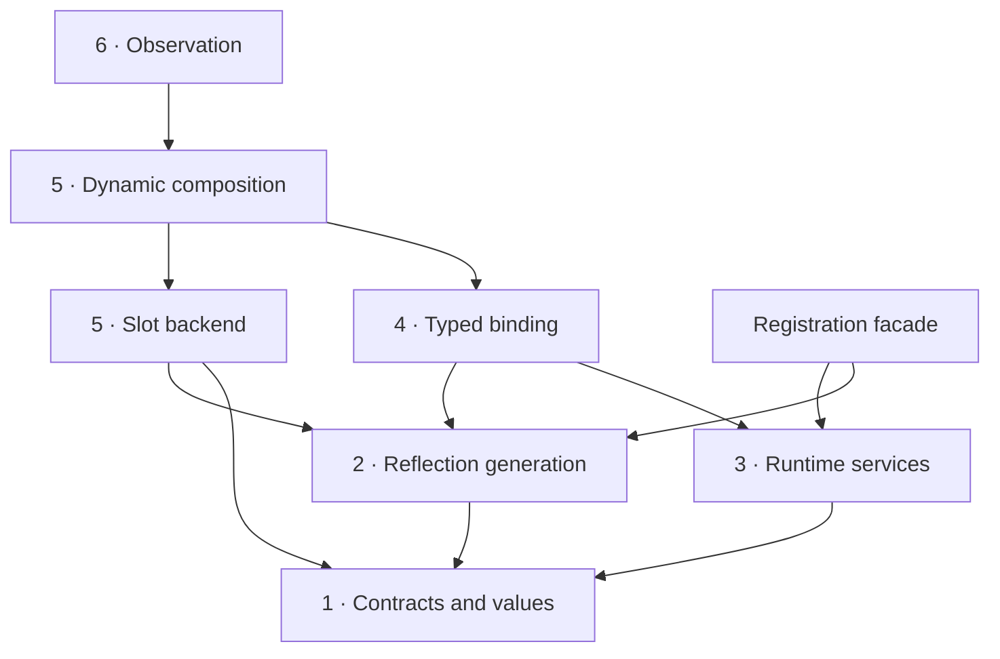

# Architecture vision

This library should be a small runtime type system generated from C++ declarations,
with optional typed views, replaceable implementations, and observation. Its
distinctive capability is the bridge: a caller can discover an object by name,
then bind it to a typed interface without requiring that object to inherit from
the interface.

Keep that bridge central. Make each layer agree on what a type, member, argument,
reference, and callable means. Convenience APIs should compose those definitions.

!!! info "A target design, not the current API"

    This section reviews repository revision `29ddfd2` and proposes a direction.
    All C++ sketches and proposed paths in this section describe the target unless
    explicitly marked **Current API**. They are design examples, not compilable
    examples promised by this revision. The [assessment](assessment.md) separates
    observations from recommendations; the [migration](migration.md) orders the work.

## One use case, three entry points

Suppose a host receives an object selected at runtime. Its consumer only needs
`render(int) const`. A concrete renderer, a replacement callable, and an observed
renderer should satisfy the same interface and preserve the same call semantics.

```cpp
// Target sketch: application composition owns discovery and lifetime.
struct Drawable { int render(int scale) const; };

Registry registry;
register_type<Square>(registry);
auto object = registry.find_class("Square").value()
                      .construct(4).value();

auto view = try_bind<Drawable>(object).value();
int pixels = view->render(2);

auto dynamic = Dynamic<Drawable>::from(object).value();
dynamic.implement(member<Drawable, "render", int(int) const>,
                  [](int scale) { return 100 * scale; });

auto observed = observe(dynamic);
auto connection = observed.after(render_member, record_result);
```

`Registry` chooses the type. A binding checks structural compatibility. A dynamic
instance chooses the implementation of each member. Observation sees calls through
that instance. None of these choices changes the concrete C++ type of `Square`.

## Dependency direction

Arrows mean **depends on**, not execution order. Numbers identify chapters; this is
a dependency graph, not a requirement to pass through every layer on every call.



Generation produces descriptors and native call targets. Runtime services consume
them. Typed binding uses generated interface descriptions and runtime resolution.
The slot backend produces another kind of call target. `Dyn` composes binding with
slots; hooks decorate the composition. The runtime never includes `Dyn` or hooks.

## Layer ownership

| Chapter | Owns | Does not own |
| --- | --- | --- |
| [Contracts and values](contracts.md) | Identity, signatures, storage views, call protocol, diagnostics | Global registration, observers |
| [Reflection generation](generation.md) | C++ discovery, supported-member policy, native thunks, interface schemas | Registry mutation, instance state |
| [Runtime services](runtime.md) | Registry, lookup, inheritance resolution, checked invocation | Typed field synthesis, replacements |
| [Typed binding](typed-binding.md) | Structural conformance, binding plans, typed call syntax | Object construction policy, mutable slots |
| [Dynamic composition](dynamic.md) | Slot lifetime, replacement, wrapping, real/dynamic transitions | Reflection lookup algorithms, signals |
| [Observation](observation.md) | Subscriptions, delivery order, disconnection | A second invocation protocol |

## Scope and tradeoffs

Retain header-only distribution and the existing umbrella includes during migration.
Layering is about dependencies and contracts; it does not require shared libraries,
virtual service classes, or a dependency-injection framework.

Use exact type compatibility plus supported public upcasts. Keep automatic numeric
conversion, general C++ overload resolution, and coercion out of the initial
contract. Structural binding is a documented subset of C++ call compatibility.

Target one executable and a compatible toolchain first. Process-local identity is
not a serialization key or a plugin ABI. Hot unloading, cross-compiler metadata,
RPC, serialization, and automatic interception of direct C++ calls are separate
projects. Virtual inheritance can remain explicitly unsupported until generated
cast operations and conformance tests support it.

Immutable descriptors and binding plans cost some metadata and ownership bookkeeping.
They buy stable handles and a place to validate once. Start with an owning result
representation for values; measure allocation costs before adding inline storage.
Do not promise virtual-call performance without measurements.

## How to use this section

Read the assessment, then contracts and runtime services to establish the central
invariants. Use generation and typed binding to implement the bridge. Add dynamic
composition and observation once the common call path is coherent. The migration
chapter turns these boundaries into independently reviewable changes.

Diagrams use Mermaid through the existing Material theme's
[native diagram integration](https://squidfunk.github.io/mkdocs-material/reference/diagrams/).
Their editable sources live directly in Markdown; no separate diagram build tool
is required. See [documentation verification](migration.md#documentation-verification)
for rendering checks and the browser dependency.
