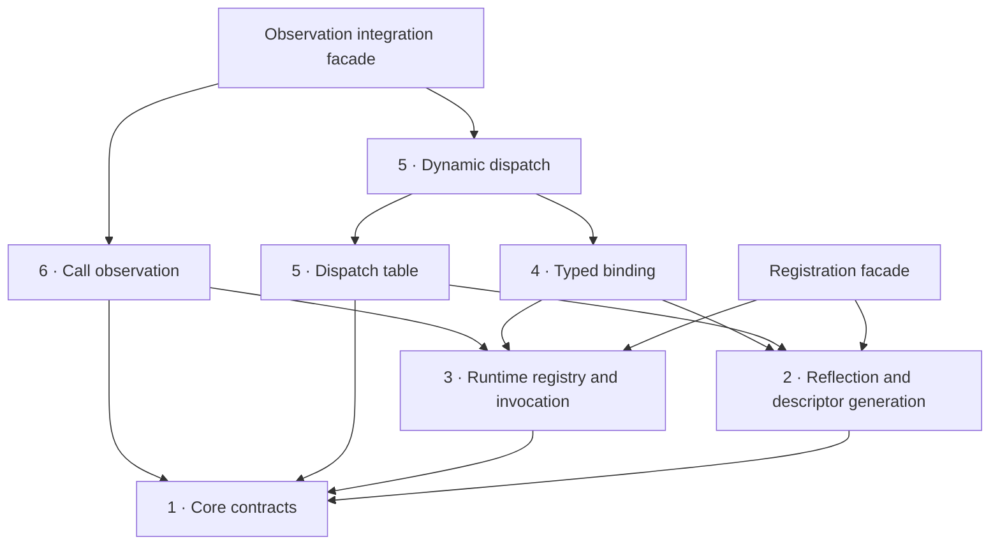

# Architecture vision

This library should be a small runtime type system generated from C++ declarations,
with optional typed views, replaceable implementations, and observation. Its
distinctive capability is the bridge: a caller can discover an object by name,
then bind it to a typed interface without requiring that object to inherit from
the interface.

Keep that bridge central. Make each layer agree on what a type, member, argument,
reference, and callable means. Convenience APIs should compose those definitions.

!!! info "A target design, not the current API"

    This section reviews repository revision `29ddfd2` and proposes a direction.
    C++ sketches and proposed paths describe the target, not compilable examples
    promised by this revision. The [assessment](assessment.md) separates observations
    from recommendations. The [migration guide](migration.md) orders the work and
    is the sole reference for superseded names and compatibility.

## One use case, three entry points

Suppose a host receives an object selected at runtime. Its consumer only needs
`render(int) const`. A concrete renderer, a replacement callable, and an observed
renderer should satisfy the same interface and preserve the same call semantics.

```cpp
// Target sketch: application composition owns discovery and lifetime.
struct Drawable { int render(int scale) const; };

Registry registry;
register_type<Square>(registry);
auto object = registry.find_class("Square").value()
                      .construct(4).value();

auto view = try_bind<Drawable>(object).value();
int pixels = view->render(2);

auto dynamic = Dynamic<Drawable>::from(object).value();
constexpr auto render_member = member<Drawable, "render", int(int) const>;
dynamic.implement(render_member, [](int scale) { return 100 * scale; }).value();

auto observed = observe(dynamic, observer_error_sink);
auto subscription = observed.after(render_member, record_result);
int recorded_pixels = observed->render(2);
```

`Registry` chooses the type. A binding checks structural compatibility. A dynamic
instance chooses the implementation of each member. Observation sees calls through
the returned observed adapter; calls through `dynamic` itself bypass that adapter.
None of these choices changes the concrete C++ type of `Square`.

## Public vocabulary

| Name | Meaning |
| --- | --- |
| `Registry` | Application-owned type catalog |
| `Object` / `ObjectView` | Owned storage / access that can retain an owner or borrow |
| `Proxy<Interface>` | Typed forwarding through a structural binding |
| `DispatchTable<Interface>` | Owned slots supplying replaceable operations |
| `Dynamic<Interface>` | Dispatch table, optional native object, and typed proxy |
| `Observed<Source>` | Adapter created by `observe(...)` that reports successful calls through itself |
| `Subscription` | Scoped registration; destruction or `unsubscribe()` removes it |
| `DispatchHandle` | Retained access to member dispatch |
| `CallCompletedEvent` | Read-only, call-scoped successful-completion event |
| `RetainedRef<T>` | Reference result plus its actual lifetime anchor |

`Dynamic::dispatch()` follows published state changes. `capture_binding()` returns
a proxy tied to the current generation. `detach_native()` removes the native
baseline and affected targets; `reset(Object)` publishes a new native generation.
`reset_native<T>(args...)` constructs the concrete type explicitly before reset.

Start with the [usage guide](usage.md) for ownership, overload replacement,
failed binding, state transitions, and retained results. Applications do not need
to construct binding plans or call frames to use these operations.

### Vocabulary for implementers

`BindingPlan` records a reusable structural mapping; `BindingState` pairs it with
an instance's dispatch handle. `ResolvedCall` retains the selected target, adjusted
receiver, and owners for one invocation. `CallFrame` carries arguments and temporary
storage. `CallTarget` is an opaque validated operation that backend authors can save
and install. These are implementation and extension contracts, not additional
steps in the basic application workflow.

## Dependency direction

Arrows mean **depends on**, not execution order. Numbers identify chapters; this is
a dependency graph, not a requirement to pass through every layer on every call.



Generation produces descriptors and native call targets. The runtime consumes
them. Typed binding uses generated interface schemas and runtime resolution.
`DispatchTable` supplies replaceable call targets. `Dynamic` composes binding with
the table and exposes live dispatch. `Observed` consumes the common dispatch-handle
contract and runtime checked invocation; integration code connects it to `Dynamic`.
The runtime never includes `Dynamic` or `Observed`.
Within runtime, checked invocation is independent of registry and lookup headers;
observation consumes only that invocation service and core contracts.

## Layer ownership

| Chapter | Owns | Does not own |
| --- | --- | --- |
| [Core contracts](contracts.md) | Identity, signatures, storage views, dispatch handles, resolved calls/protocol, diagnostics | Global registration, observers |
| [Reflection and descriptor generation](generation.md) | C++ discovery, supported-member policy, native thunks, interface schemas | Registry mutation, instance state |
| [Runtime registry and invocation](runtime.md) | Registry, lookup, inheritance resolution, checked invocation | Typed field synthesis, replacements |
| [Typed binding](typed-binding.md) | Structural plans, binding states, typed call syntax | Object construction policy, mutable slots |
| [Dynamic dispatch](dynamic.md) | Slot lifetime, live dispatch state, replacement, wrapping, native/hybrid/detached transitions | Reflection lookup algorithms, signals |
| [Call observation](observation.md) | `Observed`, subscriptions, delivery order, unsubscription | Replacement chains, a second invocation protocol |

## Scope and tradeoffs

Retain header-only distribution and the existing umbrella includes during migration.
Layering is about dependencies and contracts; it does not require shared libraries,
virtual service classes, or a dependency-injection framework.

Use exact type compatibility plus supported public upcasts. Keep automatic numeric
conversion, general C++ overload resolution, and coercion out of the initial
contract. Structural binding is a documented subset of C++ call compatibility.

Target one executable and a compatible toolchain first. Process-local identity is
not a serialization key or a plugin ABI. Hot unloading, cross-compiler metadata,
RPC, serialization, and automatic interception of direct C++ calls are separate
projects. Virtual inheritance can remain explicitly unsupported until generated
cast operations and conformance tests support it.

Immutable descriptors and binding plans cost some metadata and ownership bookkeeping.
They buy stable handles and a place to validate once. Start with an owning result
representation for values; measure allocation costs before adding inline storage.
Do not promise virtual-call performance without measurements.

Feasibility depends on proving the lifetime and call contracts on the configured
compiler. Complete a narrow prototype with out-parameters, move-only results,
closure-owned references, replacement, and observation before broad migration.
Measure its compile time and dispatch allocations before expanding properties,
operators, or qualifier support. The [migration guide](migration.md) defines this
checkpoint and records the limits of the current build baseline.

## How to use this section

Read the assessment, then core contracts and runtime registry and invocation to
establish the central invariants. Use generation and typed binding to implement
the bridge. Add dynamic dispatch and call observation once the common call path
is coherent. The migration chapter turns these boundaries into reviewable changes.
The generation chapter's [initial capability table](generation.md#initial-callable-capabilities)
is the reference for first-version support; broader operation sketches describe
extension points, not a promise that all capabilities ship together.

Diagrams use Mermaid through the existing Material theme's
[native diagram integration](https://squidfunk.github.io/mkdocs-material/reference/diagrams/).
Their editable sources live directly in Markdown; no separate diagram build tool
is required. See [documentation verification](migration.md#documentation-verification)
for rendering checks and the browser dependency.
