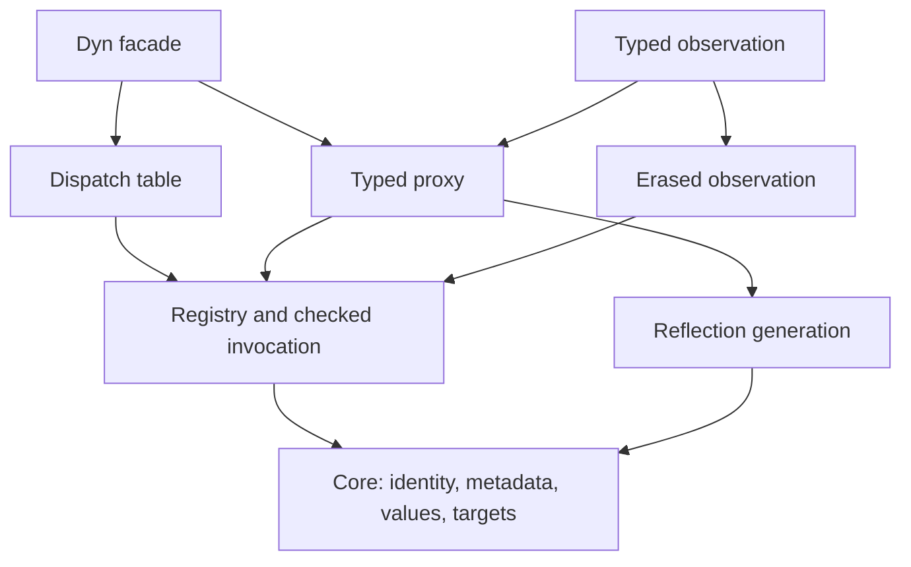

# Architecture

The library separates reflection generation from runtime contracts. All modules
are header-only. This section describes the implemented state.

## Modules

| Headers under `include/refl/` | Responsibility |
| --- | --- |
| `core/{type,descriptor,error}.hpp` | Exact identity, signatures, metadata, diagnostics |
| `core/{value,call}.hpp` | Views, owners, frames, and targets |
| `runtime/registry.hpp` | Independent catalogs |
| `runtime/invoke.hpp` | Shared call validation and extraction |
| `reflect/native.hpp` | Native operation generation |
| `reflect/schema.hpp` | Declaration-only interface schemas |
| `refl.hpp` | Full descriptor generation and runtime object/member handles |
| `dyn/proxy.hpp` | Shared binding plans and typed calls |
| `dynamic/dispatch_table.hpp` | Owned targets and generation publication |
| `dyn.hpp` | Typed dynamic facade |
| `extensions/observed.hpp` | Reflection-free completion events and subscriptions |
| `extensions/observed_dyn.hpp` | Typed method and property observation |

Core, registry, invocation, dispatch, and erased observation compile without
reflection. Generation and typed facades use C++26 reflection. Include-boundary
tests enforce this separation.

## Read next

- [Metadata and calls](contracts.md): identity, ownership, validation, and errors.
- [Typed binding](typed-binding.md): structural matching and shared plans.
- [Dynamic state](dynamic.md): replacement, reset, capture, and detachment.
- [Observation](observation.md): delivery and interception boundaries.

## Migration status

| Complete | Evidence |
| --- | --- |
| Reflection-independent core contracts | `core_headers`, `core_include_boundaries`, `core_contracts` |
| Retained metadata and isolated registries | `metadata_lifetime`, `registry_contracts` |
| Shared native/runtime call frames | `runtime_contracts`, `refl_api` |
| Shared typed binding plans | `binding_contracts`, `dyn_api` |
| Owned dynamic generations | `dynamic_state`, `dispatch_table_api`, `call_contract` |
| Typed method and property observation | `observed_api`, `call_contract` |
| Executable usage documentation | `usage` |

The migration through observation is complete. Final header and API cleanup remains.
Dynamic state and observation mutation require caller synchronization. Cross-DSO
identity and stable serialized member IDs are outside the current contract.
