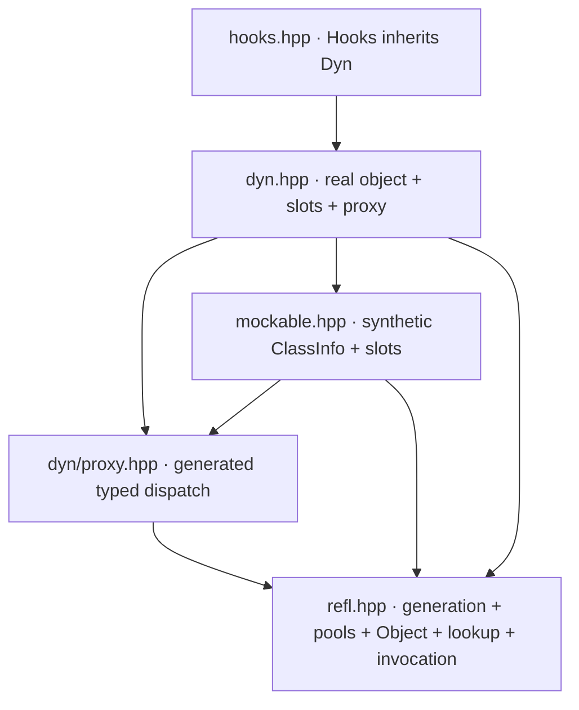

# Migration and verification

Refactor along one vertical scenario: register `Square`, construct it by name,
bind it to `Drawable`, replace `render`, then observe its completion. Keep each
step working as responsibilities move behind new boundaries.

The milestones below are ordered by semantic dependencies. Header moves alone
are not proof that a layer has been extracted.

## Proposed destination

```text
include/refl/
  core/          identity, descriptors, values, call frames, errors
  reflect/       common schemas, native generation, supported-member policy
  runtime/       registry, lookup, checked invocation
  adapters/      typed proxy
  dynamic/       dispatch_table.hpp and dynamic.hpp
  extensions/    observed.hpp
  register.hpp   generation + registry integration
  refl.hpp       compatibility umbrella for core runtime + registration
```

Keep this header-only. Add a Meson dependency object for consumers so include
paths and required compile options have one definition. Fine-grained headers can
come gradually; start with the smallest split that makes a dependency enforceable.

## Reviewable milestones

| Step | Concrete change | Completion evidence |
| --- | --- | --- |
| 0. Establish baseline | Run existing configured tests; add existing dispatch/observation executables to Meson; inventory API/documentation mismatches | Report each component's pass/fail state separately; do not treat unregistered files as tested |
| 0a. Prove the risky contracts | Build a narrow end-to-end prototype across runtime, proxy, slots, and observation before broad migration | Out-parameter, move-only, and closure-reference scenarios below pass; record initial compile time and dispatch allocations |
| 1. Extract contracts | Introduce complete type uses/member IDs, immutable descriptor handles, explicit value access, dispatch handles and resolved calls; preserve legacy API translation | Qualifier/case collisions are distinguishable; synthetic handles survive source destruction; contracts compile without reflection |
| 2. Unify calls | Add common argument frames, validation, result/lifetime policies, and owned call targets; route runtime calls through them | Out-parameter, const, move-only, reference, void, and exception contract scenarios pass; callable-context anchors survive replacement |
| 3. Separate generation/publication | Extract native/interface schemas; put pools behind `Registry`; remove global dependency from descriptor relationships | Interface-only description has no linker dependence on method definitions; two isolated registries work |
| 4. Unify binding | Centralize hierarchy resolution; separate structural plans, binding states, and resolved calls; route typed calls through common frames | Runtime/proxy conformance matrix agrees; failed rebind preserves old view; shared plans isolate instances and observe later replacements |
| 5. Stabilize dynamic state | Use member-keyed owned targets; separate dispatch table from proxy; implement live dispatch handles and declared capture dependencies | Saved targets survive replacement; wrapping composes; detachment handles tracked and unknown dependencies; captured bindings and live dispatch handles follow their specified generations |
| 6. Isolate observation | Add public Observed adapter, subscription tokens, read-only events, explicit delivery policy | Native dispatch handles work without Dynamic; source lifetime, reentrancy, listener failure, and subscription survival across reset pass |
| 7. Publish the boundaries | Finish header moves behind compatibility includes; align API docs/samples; complete consumer target | Old includes compile; accumulated dependency and standalone-consumer checks pass; diagrams match actual dependencies |

If step 0 exposes failures, record them and fix those blocking the vertical
scenario in separate changes. Do not encode accidental behavior as a permanent
contract merely to obtain a green baseline.

At every extraction step, add its standalone-header and include-boundary checks
immediately. Step 7 completes coverage; it is not the first enforcement point.

### Early prototype acceptance

Keep the prototype limited to enough operations to exercise `void update(int&)`,
a move-only value result, and a reference into a replacement closure. Use the
existing adapters where possible, with the proposed contracts at the boundary;
this is a feasibility checkpoint, not a second production invocation engine.
Promote its fixtures as the corresponding implementation milestones land.

Verify caller mutation through runtime and typed calls, observation without
copying the move-only result, and a retained closure reference surviving slot
replacement. Bind two instances with one structural plan and prove isolation.
Check that subsequent calls see replacements, captured bindings keep their generation
after reset, and observed calls follow fresh state while direct calls emit no
events. Include declared native captures and unknown detachment dependencies.

Record clean consumer compile time and direct/runtime/proxy/slot/observed call
costs and allocation counts on the same toolchain. Use this evidence to decide
whether to expand the supported surface; keep result-storage optimizations behind
the established semantic contract.

### Recorded baseline limitations

A review of revision `7eb6bbe` using the configured GCC 16.2.0 environment found:

- The strict MkDocs build passed.
- The default C++ test build stopped with an internal compiler error during LTO
  linking of `test_dyn`; the complete test suite did not run.
- With `-Db_lto=false`, `selfcheck` and `refl_api` passed, but `test_dyn` failed
  assembly with a duplicate `Mockable<Point>::impl_trampoline` symbol.
- `test_mockable.cpp` and `test_hooks.cpp` were not registered in Meson and were
  not run by these checks.

These are observations about that revision and toolchain, not permanent compiler
limitations or proof that the target design works. Stabilize and rerun the baseline
before claiming end-to-end feasibility; record configuration changes separately.

## Legacy implementation evidence

The following names and source links describe revision `29ddfd2`, not the target
API. They preserve the evidence for the [repository assessment](assessment.md).



These are header dependencies, with a few redundant edges omitted. The public
“two layers” description hides both reusable components and an optional extension.

| Evidence in this revision | Architectural consequence | Direction |
| --- | --- | --- |
| [`refl.hpp`](https://github.com/swuerl/cpp_runtime_reflection/blob/29ddfd2/include/refl/refl.hpp): `RegistrarHolder::make_info`, global pools, `Object`, hierarchy helpers, and public handles share one header | Compiler reflection, process policy, and runtime semantics cannot be consumed independently | Extract contracts first, then generation and runtime services |
| Same header: `normalize_type` lowercases and removes qualifiers, while `extract_arg` compares display names and performs upcasts | Lookup identity and invocation compatibility answer different questions through string conventions | Give identity, complete signatures, and compatibility separate representations |
| Same header: `Object` owns `ClassInfo`; `Class`, `Function`, and `Field` hold raw metadata pointers | Handle validity depends on where metadata came from; synthetic metadata is not necessarily process-lived | Handles retain immutable descriptor storage |
| [`proxy.hpp`](https://github.com/swuerl/cpp_runtime_reflection/blob/29ddfd2/include/refl/dyn/proxy.hpp): `populate` resolves structure and `TypedMethod` builds its own argument storage | Typed calls can diverge from core forwarding and resolution semantics | Produce a binding plan and reuse the call-frame contract |
| [`mockable.hpp`](https://github.com/swuerl/cpp_runtime_reflection/blob/29ddfd2/include/refl/mockable.hpp): synthetic `T$mock` metadata, name-keyed slots, raw `ctx`, and `proxy()` convenience | Interface identity, storage identity, overload selection, and adapter dependency are intertwined | Separate interface from storage; key slots by member identity; own callable context |
| [`dyn.hpp`](https://github.com/swuerl/cpp_runtime_reflection/blob/29ddfd2/include/refl/dyn.hpp): `wire_real_slots`, `restore`, `wrap`, and mode transitions coordinate several stores and pointers | Lifetime and transition correctness depend on each operation remembering every related store | Publish complete backend states and compose owned call targets |
| [`hooks.hpp`](https://github.com/swuerl/cpp_runtime_reflection/blob/29ddfd2/include/refl/hooks.hpp): derived class reaches `mockable_`; callbacks and saved property contexts live in separate maps | Observation is coupled to dynamic storage layout and wrapper lifetime | Observed endpoint adapter outside replacement chains, plus connection tokens |
| [`tests/meson.build`](https://github.com/swuerl/cpp_runtime_reflection/blob/29ddfd2/tests/meson.build) registers `selfcheck`, `test_refl`, and `test_dyn`, but not existing `test_mockable.cpp` or `test_hooks.cpp` | A successful default test run does not cover all architectural components | Make each public layer a first-class build/test target |

### Legacy documentation drift

The existing Dyn page places `connect` and `on_change` on `Dyn`, while the source
places them on `Hooks`; it calls `Dyn` non-movable while the source declares move
operations. It also describes dispatch features that the current proxy no longer
exposes, such as property subscripting and static dispatch fields. The core design
page contains conflicting accounts of inheritance hiding and metadata ownership.

## Naming and compatibility map

The target names below are used throughout the architecture chapters. Historical
API names, superseded design names, and old include paths appear only in this
migration guide. A name in an earlier sketch does not imply an implemented API.

| Earlier name or term | Target name | Migration meaning |
| --- | --- | --- |
| `Dyn<T>`; inconsistent `Dynamic<T>` spelling | `Dynamic<Interface>` | Use the full name for the composition facade; keep the abbreviated API as compatibility sugar |
| `Mockable<T>`; slot backend | `DispatchTable<Interface>` | Replaceable operations are useful beyond mocking |
| `Hooks<T>` | `Observed<Source>` via `observe(...)` | Compose a separate observed adapter instead of inheriting from the dynamic facade |
| Connection token; `connection.disconnect()` | `Subscription`; `subscription.unsubscribe()` | The token owns a subscription; destruction unsubscribes |
| `EndpointHandle` | `DispatchHandle` | Retained access to member dispatch, exposed by `dispatch()` |
| Internal `BoundView` | `BindingState` | Per-instance plan and dispatch state, separate from the public proxy |
| `CallSnapshot` | `ResolvedCall` | Retains a selected target and receiver without copying receiver contents |
| `InvocationEvent` | `CallCompletedEvent` | Describes successful completion only |
| `make_dynamic()`; dynamic mode | `detach_native()`; detached mode | Drops native baselines and affected targets; dispatch itself was already dynamic |
| `ClassInfo`, `FunctionInfo`, `FieldInfo`, and related metadata records | `ClassDescriptor`, `FunctionDescriptor`, `FieldDescriptor`, and corresponding `*Descriptor` names | Immutable native metadata uses one suffix |
| `Class`, `Function`, `Field`, and related metadata access objects | `ClassHandle`, `FunctionHandle`, `FieldHandle`, and corresponding `*Handle` names | Handles retain their descriptors |
| Virtual fields used as a generic term | Properties | `FieldDescriptor` denotes native storage; `PropertyDescriptor` denotes capabilities |
| Unqualified access to live or captured state | `dispatch()` and `capture_binding()` | Live dispatch follows reset; a captured `Proxy<Interface>` keeps its generation |
| `Reg<T>` and `ensure_registered<T>()` | `register_type<T>(registry)` | Explicit registration is the primary spelling; the default registry remains available |

Keep `Proxy<Interface>`, `Registry`, `TypeUse`, `BindingPlan`, `CallFrame`, and
`CallTarget`. Native descriptions use `*Descriptor`; structural requirements use
`InterfaceSchema`. The target `Object` owns storage, while `ObjectView` is possibly
retained. Translate existing borrowing constructors deliberately rather than
silently making them allocate or extend lifetimes.

| Earlier chapter title | Target chapter title |
| --- | --- |
| Contracts and values | Core contracts |
| Reflection generation | Reflection and descriptor generation |
| Runtime services | Runtime registry and invocation |
| Dynamic composition | Dynamic dispatch |
| Observation | Call observation |

Typed binding keeps its chapter title. Markdown page paths remain stable so links
continue to work; navigation, headings, and diagrams use the target titles.

| Existing or previously proposed include | Target include |
| --- | --- |
| `refl/dyn.hpp`; proposed `refl/dynamic/dyn.hpp` | `refl/dynamic/dynamic.hpp` |
| `refl/mockable.hpp`; proposed `refl/dynamic/slots.hpp` | `refl/dynamic/dispatch_table.hpp` |
| `refl/hooks.hpp`; proposed `refl/extensions/hooks.hpp` | `refl/extensions/observed.hpp` |
| `refl/dyn/proxy.hpp` | `refl/adapters/proxy.hpp` |

Retain existing include paths as forwarding compatibility facades. In particular,
the observation facade supplies integration with dynamic dispatch and typed proxies;
the core observed adapter does not depend on those implementations. API wrappers
must translate changed semantics, not merely alias incompatible types.

### Existing implementation seams

Extract `populate` into a `BindingPlan` builder and move `TypedMethod` argument and
result handling onto the shared `CallFrame`. Move `Mockable::proxy()` convenience
into integration code. Introduce owned `CallTarget` values in the current
`MethodSlot` and `PropertySlot` stores, then key operations by `MemberId`.
Replace `Hooks` access to `mockable_` with public dispatch resolution and checked
invocation. Share generation queries across `RegistrarHolder::make_info`, native
registration, dispatch tables, and proxies. Preserve interface-only generation
without taking addresses of undefined methods.

## Compatibility is an explicit translation

Keep `Reg<T>`, global `find_class`, and existing umbrella paths while introducing
explicit registries. Preserve simple `Proxy<T>` construction and typed dispatch.
New `try_*` operations can sit beside current throwing conveniences.

Some semantics need deliberate changes: case/qualifier-preserving matching,
reference provenance, name-only overloaded replacement, const-borrow behavior,
and mode transitions. For each, document the old behavior, replacement spelling,
and rejection/diagnostic. A legacy string lookup may resolve a unique candidate;
it must report ambiguity when stripped qualifiers no longer select exactly one.
Do not perpetuate unsafe matching in the new core to preserve convenience syntax.

Compatibility wrappers should call the new implementation. Avoid maintaining a
second hierarchy resolver or invocation engine behind the old headers.

## Contract matrix

Use small fixtures across entry points instead of separate large scenario suites
whose semantics quietly drift. These are proposed checks, not claims about current
coverage.

| Fixture | Runtime | Proxy | DispatchTable / Dynamic | Call observation |
| --- | --- | --- | --- | --- |
| `void update(int&)` | Caller changes | Same caller changes | Replacement preserves reference | Sees completion |
| Const receiver with mutating member | Reject | Reject or unavailable syntax | Same access validation | No success event |
| Move-only value parameter/result | Explicit consumption | Same category behavior | Generic callable thunk | Observe without copy |
| Return reference into argument | Correct anchor/borrow | Document typed borrow | Same provenance policy | Retention requires capability |
| Return reference into replacement closure | Retain invoked context | Typed return remains a borrow | Retained result survives replacement | Preserve result anchor through delivery |
| Two instances sharing a structural plan | Resolve each dispatch handle | No instance state in plan | Replacing one leaves the other intact | Events belong to the invoked adapter |
| Two overloads sharing a name | Select exact declaration | Bind each independently | Replace one only | Subscribe to one only |
| Ambiguous repeated base | Diagnose | Bind fails | Native wiring uses same resolver | No synthetic success |
| User exception | Propagate target exception | Same | Same | No success event |
| Retained member handle | Descriptor remains alive | Plan retains descriptors | Synthetic descriptor remains alive | Event cannot escape unretained storage |

Add lifecycle sequences for save → replace → restore, wrap → wrap → restore,
bind → failed rebind → call, native → hybrid → detached → reset, and subscribe →
unsubscribe/destroy → invoke. Use destruction counters and sanitizers where the
configured compiler supports them. Test behavior and lifetime, not private map
layouts or pointer spellings.

## Enforce architecture in the build

Compile a translation unit including each intended public header alone. Keep a
contracts/runtime-only fixture free of reflection syntax and `<meta>`; generation
fixtures use the configured reflection-capable compiler. This makes the separation
testable without promising support for an additional compiler or older language
standard yet.

Add an include-boundary check: `core` cannot include `reflect`, `runtime`, or
adapters; `runtime` cannot include generation; dispatch tables cannot include proxy;
no lower layer includes observation. Call observation depends on contracts/runtime
and cannot include dynamic internals. Integration/umbrella headers are the deliberate
exceptions.
Exercise public operations from small consumer programs rather than granting tests
special access to internals.

Track clean consumer compile time, descriptor construction/registration cost,
bind cost, steady-state direct/runtime/proxy/slot calls, and allocation counts.
Compare relative costs on the same machine and toolchain. Optimize after the shared
contract is stable; proposed boundaries do not imply allocation-free dispatch.

## Documentation verification

Build the section with the existing development environment:

```sh
mkdocs build --strict -f docs/mkdocs.yml
mkdocs serve -f docs/mkdocs.yml
```

The build checks navigation and Markdown links. It does not execute C++ sketches
or parse Mermaid diagrams in a browser. Preview the dependency, call-sequence, and
state diagrams in both theme modes, and run every Mermaid block through the
matching Mermaid parser when editing diagram sources. Sequence-message text must
not contain an unescaped semicolon: Mermaid treats it as a statement separator.
Use plain wording or the documented `#59;` escape (see
[Mermaid sequence-diagram escaping](https://mermaid.js.org/syntax/sequenceDiagram.html#entity-codes-to-escape-characters)).
Material loads the Mermaid runtime in the browser, which may require network
access under the default theme configuration;
an offline site needs a separate asset-bundling decision. Diagram source remains
readable in Markdown.

When adopting a target API, promote its sketch into a compiled sample, update the
corresponding API reference, and label the architecture decision implemented with
its revision. Until then, retain the distinction between proposed contracts and
current behavior.
