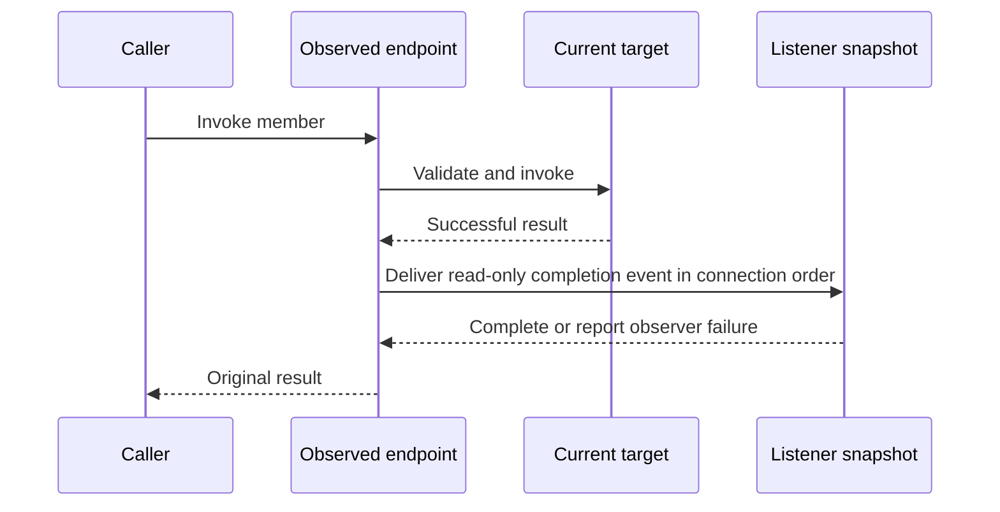

# Layer 6: Observation

Observation is an optional adapter over dynamic invocation and property operations.
It depends on public decoration operations, never on protected slot maps or a
second family of argument-unpacking trampolines. Proposed home:
`refl/extensions/hooks.hpp`; retain `refl/hooks.hpp` as a compatibility facade.

## A connection owns the subscription

```cpp
// Target sketch: RAII disconnection and an explicit receiver lifetime.
auto observed = observe(dynamic);
auto connection = observed.after(render_member,
    [weak_log](const InvocationEvent& event) {
        if (auto log = weak_log.lock()) log->record(event);
    });

connection.disconnect();           // idempotent
// Destruction also disconnects. Retain the token to remain subscribed.
```

Subscription tokens refer weakly to observer state so they can safely outlive the
source. Cross-object connections use a weak receiver or an explicitly owned
callback context. Destroying either endpoint must not leave a callback that
dereferences an untracked object address.

Method subscriptions are keyed by `MemberId`, not just a name; property
subscriptions use a member plus operation kind. Keep custom string-named signals
in a separate namespace to avoid a signal named `render` sharing storage or
semantics with a method hook.

## Delivery contract



Choose the following initial semantics:

| Situation | Behavior |
| --- | --- |
| Target succeeds | Deliver after-only event synchronously |
| Target fails validation or throws | No success event; preserve the original failure |
| Listener throws | Send exception to a configured non-throwing observer-error sink; continue listeners |
| Listener connects during delivery | New subscription begins with the next event |
| Listener disconnects during delivery | Check active status before each delivery; skip disconnected listeners |
| Listener recursively invokes source | Nested event is delivered synchronously; caller controls recursion |
| Concurrent connect/disconnect/invoke | Caller synchronizes in the initial version |

Require an explicit observer-error sink when enabling observation; a collecting
sink is useful for tests. Do not silently discard observer exceptions or turn a
successful target mutation into an apparent target failure. An alternative error
policy can be added later as an explicit adapter option.

An `InvocationEvent` is read-only and call-scoped by default. A move-only result
can be observed without copying it. Listeners that need to retain data must request
an owning copy or retained view when the value's capability and lifetime allow it.
`const Object&` alone is insufficient if its casts still grant mutable access;
use the contract layer's read-only view.

## Define what changes are observable

A property event follows a successful write through the observed endpoint. Call
it `after_write` unless equality comparison actually establishes a change. For a
virtual or write-only property, do not promise the final stored value: a setter
may transform its input and a getter may be unavailable. Report completion plus
an optional read-back view where supported; old/new snapshots require an explicit
copy/read policy.

Direct `dynamic.get().x = value`, mutation through an escaped field reference, and
native calls that bypass the observed endpoint do not emit events. Instrumenting
those would require cooperation from the concrete class.

Keep subscriptions at the observed endpoint, outside the replacement chain.
`implement` and `restore` then change the target without accidentally removing
observation. After `reset`, the observed endpoint resolves fresh state and keeps
subscriptions to the same interface members. Previously captured raw proxies are
separate views and do not acquire new observation behavior retroactively.

## Migration seam and proof

First expose a public owned decoration API from dynamic composition. Replace
`Hooks` access to `mockable_` with that boundary. Add tokens, member-based keys,
read-only events, and the error sink before expanding signal conveniences.

Verify listener order, disconnection during delivery, source/receiver destruction,
reentrant calls, move-only results, write-only properties, observer exceptions,
and subscription survival across replacement/reset. Include a direct-access case
that deliberately emits no event, so the interception boundary remains visible.

Next: [migration and verification](migration.md).
