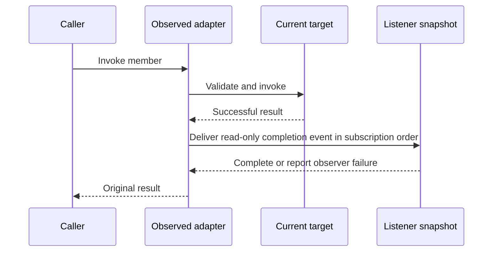

# Layer 6: Call observation

`Observed<Source>` is an optional adapter over a source's dispatch handle and
property operations, constructed by `observe(source, observer_error_sink)`.
It depends on the common dispatch-handle contract and runtime checked invocation.
`Dynamic` integration supplies its live dispatch handle; native dispatch can also
be observed without replacement machinery. Proposed home:
`refl/extensions/observed.hpp`. Compatibility includes live in the migration guide.

## A Subscription owns the registration

```cpp
// Target sketch: RAII unsubscription and an explicit receiver lifetime.
auto observed = observe(dynamic, observer_error_sink);
Subscription subscription = observed.after(render_member,
    [weak_log](const CallCompletedEvent& event) {
        if (auto log = weak_log.lock()) log->record(event);
    });

int pixels = observed->render(2);  // invokes the target, then delivers the event
int direct = dynamic->render(2);   // bypasses this observed adapter

subscription.unsubscribe();        // idempotent
// Destruction also unsubscribes. Retain the token to remain subscribed.
```

`Subscription` tokens refer weakly to observer state so they can safely outlive the
source. Subscriptions across objects use a weak receiver or an explicitly owned
callback context. Destroying a source or receiver must not leave a callback that
dereferences an untracked object address.

`Observed` retains the source dispatch handle. For live dynamic dispatch this keeps
the current state available even if the original facade is destroyed.
Destroying the observed adapter releases its subscriptions; an in-progress call
retains the delivery state until it finishes. Tokens alone keep neither alive.

Method subscriptions are keyed by `MemberId`, not just a name; property
subscriptions use a member plus operation kind. Keep custom string-named signals
in a separate namespace to avoid a signal named `render` sharing storage or
semantics with a method subscription.

## Delivery contract



Choose the following initial semantics:

| Situation | Behavior |
| --- | --- |
| Checked target invocation returns a captured erased result | Deliver after-only event synchronously, before typed extraction |
| Target fails validation or throws | No success event; preserve the original failure |
| Argument preparation or delivery bookkeeping fails before target entry | Propagate preparation failure; target is not entered and no event is delivered |
| Target returns but erased result capture fails | Propagate capture failure; target effects remain and no completion event is available |
| Typed result extraction throws after delivery | Propagate extraction failure; the completion event has already been delivered |
| Listener throws | Send exception to a configured non-throwing observer-error sink; continue listeners |
| Listener subscribes during delivery | New subscription begins with the next event |
| Listener unsubscribes during delivery | Check active status before each delivery; skip inactive listeners |
| Listener recursively invokes source | Nested event is delivered synchronously; caller controls recursion |
| Concurrent subscribe/unsubscribe/invoke | Caller synchronizes in the initial version |

“Completed” means the target returned and its erased result was captured. It does
not promise that the caller received a typed value. A user-defined move into result
storage can fail after a target mutation; a later move out can fail after listeners
run. Keep preparation, target execution, result capture, observer delivery, and typed
extraction distinct in the documented failure model. `Result` does not convert
allocation or user copy/move exceptions into validation failures or roll back effects.

Prepare the listener snapshot and required delivery bookkeeping before target entry.
This fixes the eligible listeners for the outer call; subscriptions added by the
target or a listener begin with the next call, including a nested call. Check each
snapshot entry's active flag immediately before delivery. Deliver from this prepared
state without further adapter-owned allocation after result capture. Optional copies
or read-back requested by a listener are listener work and use the observer-error
sink on failure. Result capture itself can still allocate or throw; this is not a
promise of allocation-free or non-throwing invocation.

Require an explicit observer-error sink when enabling observation; a collecting
sink is useful for tests. Do not silently discard observer exceptions or turn a
successful target mutation into an apparent target failure. An alternative error
policy can be added later as an explicit adapter option.

A `CallCompletedEvent` is read-only and call-scoped by default. A move-only result
can be observed without copying it. Listeners that need to retain data must request
an owning copy or retained view when the value's capability and lifetime allow it.
`const Object&` alone is insufficient if its casts still grant mutable access;
use the contract layer's read-only view.

The event exposes member identity and operation kind, a read-only receiver view
where applicable, post-call argument views with their original categories, and the
captured erased result. Argument views describe the supplied argument storage,
not destroyed by-value parameter locals. Out-parameters reflect writes; arguments
consumed into by-value parameters may be moved from. There is no implicit snapshot
of original inputs. Listeners may inspect only what the value's post-call state
supports. An anchored view of an owning result also does not freeze its value:
later typed extraction can move from that storage. Retention extends lifetime;
an explicit supported copy is needed to preserve pre-extraction contents.

`try_call_retained<T>(observed, member, args...)` uses this same delivery path and
exports the actual result anchor. It must not bypass subscriptions by extracting
the underlying source handle. Ordinary typed reference calls obey the core
reference-export check before target entry, even when observation is enabled.

Read-only access through an event does not prevent a listener from mutating the
same object through another handle. Listeners must respect the invalidation rules
of result and argument views for the rest of delivery and the caller's use.
For example, a listener must not reallocate a vector whose element is the borrowed
result still being returned. Keeping its receiver alive does not prevent that
invalidation; request a supported owning snapshot when stable data is needed.

## Define what changes are observable

A property event follows a successful write through `Observed`. Call it
`after_write` unless equality comparison actually establishes a change. For a
virtual or write-only property, do not promise the final stored value: a setter
may transform its input and a getter may be unavailable. Report completion plus
an optional read-back view where supported; old/new snapshots require an explicit
copy/read policy.

Only calls through `observed` emit its events. `observe(dynamic, sink)` does not
modify existing `Dynamic` or proxy dispatch. Direct `dynamic->render(...)`,
`dynamic.get().x = value`, mutation through an escaped field reference, and native
calls that bypass the observed adapter do not emit those events. Instrumenting
direct native access would require cooperation from the concrete class.

Keep subscriptions in `Observed`, outside the replacement chain.
`implement` and `restore` then change the target without accidentally removing
observation. After `reset`, the adapter resolves fresh state through its live handle
and keeps subscriptions to the same interface members. Previously captured proxies are
separate views and do not acquire new observation behavior retroactively.

Dispatch interception is separate from `wrap(member, fn)`. The observed adapter
holds subscriptions around checked invocation of a `ResolvedCall`;
`wrap` changes the selected target chain inside the source. Building subscriptions
as ordinary slot wrappers would let replacement or restoration remove them.

## Implementation boundary and proof

Build `Observed` on public dispatch resolution and checked invocation. Keep
`Dynamic` factory sugar in integration code so observation does not include
dynamic internals. The migration guide records the existing coupling to remove.
Add tokens, member-based keys, read-only events, and the error sink before
expanding signal conveniences.

Verify listener order, unsubscription during delivery, source/receiver destruction,
reentrant calls, move-only results, write-only properties, observer exceptions,
and subscription survival across replacement/reset. Include a direct-access case
that deliberately emits no event, so the interception boundary remains visible.
Also observe a native dispatch handle without creating a dispatch table or typed proxy.
Inject failures in preparation, erased capture, and typed extraction and assert both
target effects and event counts. Verify post-call moved-from argument views and
subscriptions added during target execution. Return a closure reference, replace
its slot in a listener, and prove retained extraction survives while ordinary typed
export is rejected before invocation.

Next: [migration and verification](migration.md).
