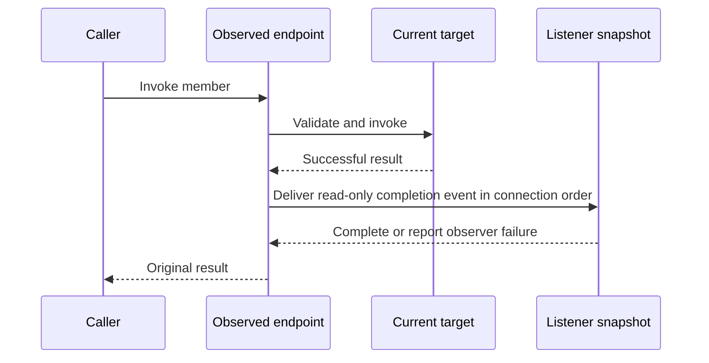

# Layer 6: Observation

Observation is an optional adapter over invocation endpoints and property operations.
It depends on the common endpoint contract and runtime checked invocation, never
on protected slot maps or a second family of argument-unpacking trampolines.
`Dyn` integration supplies its live endpoint; native endpoints can also be observed
without replacement machinery. Proposed home:
`refl/extensions/hooks.hpp`; retain `refl/hooks.hpp` as a compatibility facade.

## A connection owns the subscription

```cpp
// Target sketch: RAII disconnection and an explicit receiver lifetime.
auto observed = observe(dynamic, observer_error_sink);
auto connection = observed.after(render_member,
    [weak_log](const InvocationEvent& event) {
        if (auto log = weak_log.lock()) log->record(event);
    });

int pixels = observed->render(2);  // invokes the target, then delivers the event
int direct = dynamic->render(2);   // bypasses this observed adapter

connection.disconnect();           // idempotent
// Destruction also disconnects. Retain the token to remain subscribed.
```

Subscription tokens refer weakly to observer state so they can safely outlive the
source. Cross-object connections use a weak receiver or an explicitly owned
callback context. Destroying either endpoint must not leave a callback that
dereferences an untracked object address.

The observed adapter retains the source endpoint. For a dynamic endpoint this
keeps its current state available even if the original facade is destroyed.
Destroying the observed adapter releases its subscriptions; an in-progress call
retains the delivery state until it finishes. Tokens alone keep neither alive.

Method subscriptions are keyed by `MemberId`, not just a name; property
subscriptions use a member plus operation kind. Keep custom string-named signals
in a separate namespace to avoid a signal named `render` sharing storage or
semantics with a method hook.

## Delivery contract



Choose the following initial semantics:

| Situation | Behavior |
| --- | --- |
| Target succeeds | Deliver after-only event synchronously |
| Target fails validation or throws | No success event; preserve the original failure |
| Listener throws | Send exception to a configured non-throwing observer-error sink; continue listeners |
| Listener connects during delivery | New subscription begins with the next event |
| Listener disconnects during delivery | Check active status before each delivery; skip disconnected listeners |
| Listener recursively invokes source | Nested event is delivered synchronously; caller controls recursion |
| Concurrent connect/disconnect/invoke | Caller synchronizes in the initial version |

Require an explicit observer-error sink when enabling observation; a collecting
sink is useful for tests. Do not silently discard observer exceptions or turn a
successful target mutation into an apparent target failure. An alternative error
policy can be added later as an explicit adapter option.

An `InvocationEvent` is read-only and call-scoped by default. A move-only result
can be observed without copying it. Listeners that need to retain data must request
an owning copy or retained view when the value's capability and lifetime allow it.
`const Object&` alone is insufficient if its casts still grant mutable access;
use the contract layer's read-only view.

Read-only access through an event does not prevent a listener from mutating the
same object through another handle. Listeners must respect the invalidation rules
of result and argument views for the rest of delivery and the caller's use.
For example, a listener must not reallocate a vector whose element is the borrowed
result still being returned. Keeping its receiver alive does not prevent that
invalidation; request a supported owning snapshot when stable data is needed.

## Define what changes are observable

A property event follows a successful write through the observed endpoint. Call
it `after_write` unless equality comparison actually establishes a change. For a
virtual or write-only property, do not promise the final stored value: a setter
may transform its input and a getter may be unavailable. Report completion plus
an optional read-back view where supported; old/new snapshots require an explicit
copy/read policy.

Only calls through `observed` emit its events. `observe(dynamic, sink)` does not
modify existing `Dyn` or proxy dispatch. Direct `dynamic->render(...)`,
`dynamic.get().x = value`, mutation through an escaped field reference, and native
calls that bypass the observed endpoint do not emit those events. Instrumenting
direct native access would require cooperation from the concrete class.

Keep subscriptions at the observed endpoint, outside the replacement chain.
`implement` and `restore` then change the target without accidentally removing
observation. After `reset`, the observed endpoint resolves fresh state and keeps
subscriptions to the same interface members. Previously captured raw proxies are
separate views and do not acquire new observation behavior retroactively.

Endpoint interception is separate from `wrap(member, fn)`. The observed adapter
holds subscriptions around checked invocation of a freshly resolved snapshot;
`wrap` changes the selected target chain inside the source. Building subscriptions
as ordinary slot wrappers would let replacement or restoration remove them.

## Migration seam and proof

First expose public endpoint resolution and checked invocation. Replace
`Hooks` access to `mockable_` with an observed endpoint adapter. Keep `Dyn` factory
sugar in integration code so observation does not include dynamic internals.
Add tokens, member-based keys, read-only events, and the error sink before
expanding signal conveniences.

Verify listener order, disconnection during delivery, source/receiver destruction,
reentrant calls, move-only results, write-only properties, observer exceptions,
and subscription survival across replacement/reset. Include a direct-access case
that deliberately emits no event, so the interception boundary remains visible.
Also observe a native endpoint without creating a slot backend or typed proxy.

Next: [migration and verification](migration.md).
