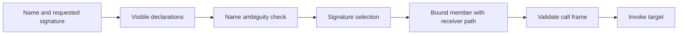

# Layer 3: Runtime registry and invocation

The runtime makes descriptors discoverable and callable. It depends on core
contracts; native descriptor generation is a producer, not a prerequisite for
lookup. Proposed home: `refl/runtime/{registry,lookup,invoke}.hpp`.

Keep `invoke.hpp` independently consumable: it includes contracts, not `registry.hpp`
or `lookup.hpp`. Native lookup produces resolved operations; invocation consumes
them without consulting a catalog. Observing an already-bound dispatch handle
therefore requires neither registry storage nor name-resolution machinery. Enforce
this boundary with include checks as well as the broader layer rules.

Checked invocation accepts a `DispatchHandle` and produces a `ResolvedCall` before
entering user code. Native dispatch resolves descriptor operations and receiver
paths; dispatch tables expose their callable schema and resolve operations without
pretending to store that interface type.
Both use the same validator. A structural binding plan can reuse operation
selection, but it cannot cache a mutable slot's current target. Keep the resolved
call alive through completion, including synchronous observation and result extraction.

## Registry as an application-owned catalog

```cpp
// Target sketch: two catalogs can coexist without shared naming policy.
Registry editor;
Registry tests;
register_type<Square>(editor);
register_type<FakeRenderer>(tests, {.alias = "renderer"});

auto member = editor.find_class("Square").value()
                    .find_function("render", render_signature).value();
// member retains its descriptor independently of editor's map storage.
```

Use an application-owned `Registry` for isolated catalogs, or `default_registry()`
for process-wide discovery. The migration guide describes compatibility facades.

Registration publishes an immutable descriptor. Adding the same identity and
equivalent descriptor is idempotent; a conflicting descriptor or an alias claimed
by another type returns a conflict diagnostic. Do not silently replace metadata
under existing handles. Initially omit removal and replacement operations.

`ClassHandle`, `EnumHandle`, `ConstructorHandle`, `FieldHandle`, `PropertyHandle`,
and `FunctionHandle` retain the descriptors they reference. A member handle can
be a shared descriptor handle plus an index. Base edges retain or resolve through
a shared immutable descriptor graph;
they must not look up relationships in whichever global registry happens to exist.
Avoid ownership cycles by giving the graph an arena owner or keeping recursive
type references as IDs resolved by that owner.

Registry publication and lookup synchronize internally. Published descriptors can
be read concurrently. No registry lock may be held while running constructors,
methods, replacement callables, or observers. Object synchronization remains the
application's responsibility.

## Resolve once, preserve the path



One resolver serves `ClassHandle::find_*`, typed binding, operators, and native-slot
wiring. Return structured resolution results, including declaring type and the
receiver adjustment path. An overload's path belongs to that overload, not to a
shared method-name group: two selected declarations need not live in the same
base subobject.

Keep member enumeration separate from invocable lookup:

| Operation | Proposed meaning |
| --- | --- |
| `declared_members()` | Declarations owned by exactly this type |
| `visible_members()` | Visibility/hiding applied; ambiguity represented explicitly |
| `find_function(name, signature)` | One unambiguous callable or a diagnostic |
| `base_relationships()` | Graph relationships, including distinct paths |
| `try_upcast(object, type)` | One accessible subobject or an ambiguity error |

For an ordinary repeated non-virtual base, two paths lead to distinct subobjects.
Do not deduplicate that fact by type name. Name ambiguity precedes signature
selection. Distinguish “is a base somewhere” from “has an unambiguous conversion.”
Constructors remain local to their described class unless explicit inherited
constructor support is implemented.

## Fields, properties, and operations

A `FieldDescriptor` describes native storage. A `PropertyDescriptor` describes
read/write/view capabilities and may have no addressable storage. `FieldHandle`
and `PropertyHandle` expose those distinct member kinds. A field can back a
property, but exposing a getter and setter alone does not make it a field.

`MemberId` identifies the declaration. `OperationKind` identifies the requested
operation on it: one property can have separate read, write, and view operations.

Expose copy read, write, and view access separately. A const native field can
provide a read-only view; a move-only field can provide a view without a copy
getter; a virtual property may provide getters/setters without addressable storage.
Code should ask for the operation it needs and receive a capability diagnostic.

Static functions and fields belong to the class surface and require no receiver.
Do not force them into every instance proxy. Enums use the same metadata ownership
and identity rules; retain underlying signedness and width rather than declaring
`long long` the universal value domain.

## Error and lifetime example

```cpp
// Target sketch: a failed lookup/call carries actionable context.
auto result = method.try_invoke(borrow_const(square), arguments);
// error.code       = ReceiverReadOnly
// error.member     = Square::set_tint(int)
// error.expected   = mutable Square&
// error.actual     = const Square&
```

Validation failure means user code was not entered. A user exception means it may
have run and mutated state. Returning `Result` does not make the operation
transactional. Preserve that distinction in diagnostics and documentation.

## Implementation boundary and proof

First wrap the existing pools in `Registry` without changing legacy entry points.
Then give handles ownership, move hierarchy resolution behind one interface, and
replace global base queries with descriptor-graph traversal. Only then permit
independent local registries as a supported public contract.

Verify duplicate registration, catalog isolation, late registration, retained
handles, sibling-name ambiguity, repeated bases, const receivers, and calls that
re-enter registry lookup. The last scenario verifies that user code executes
outside registry locks.

Next: [typed binding](typed-binding.md).
