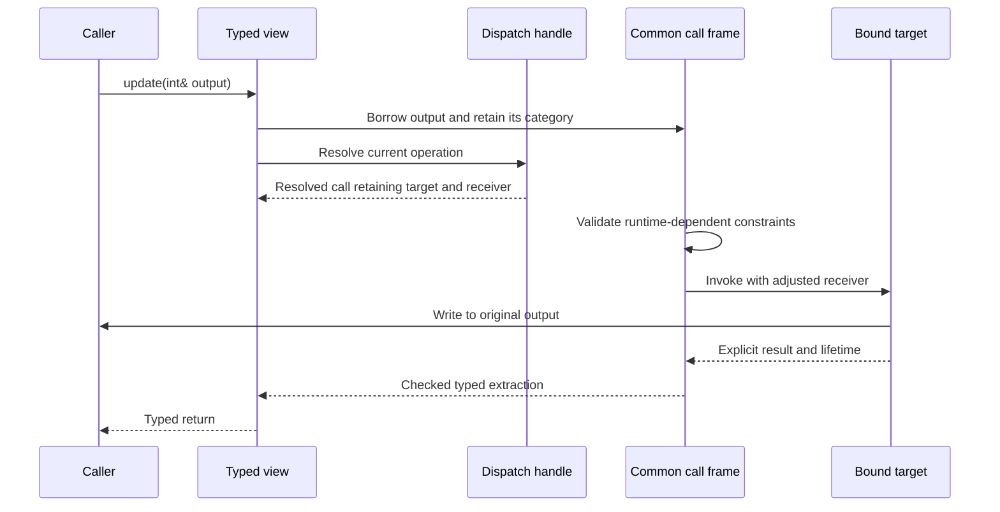

# Layer 4: Typed binding

`Proxy<Interface>` should mean “a typed view of an object satisfying this interface.”
It should work equally well with a native object and a dispatch table. It does not
own replacement policy, observe calls, or manufacture a concrete `Interface`.

Proposed home: `refl/adapters/proxy.hpp`. Dependencies are runtime registry and
invocation plus generated interface schemas; neither `Dynamic` nor `Observed`
belongs below this layer. Compatibility includes are listed in the migration guide.

## Structural binding without inheritance

Target sketch of the structural scenario:

```cpp
struct Drawable { int render(int scale) const; };
struct Square {
    int side;
    int render(int scale) const { return side * side * scale; }
};

auto square = refl::own(Square{4});
auto view = refl::try_bind<Drawable>(square).value();
int pixels = view->render(2);
```

The interface has no method bodies and the implementation has no inheritance
relationship to it. Keep this property through every internal change.
Binding a known object needs its generated descriptor but no registry publication.
Use a registry when discovery by name is part of the application workflow.

## Bind requirements to operations

```cpp
// Target sketch.
struct BindingEntry {
    MemberId requirement;
    MemberId implementation_member;
    OperationKind kind;            // method, property read/write/view
    Signature signature;
    ReceiverPath receiver_path;    // descriptor operations, no instance address
};
struct BindingPlan {
    InterfaceHandle interface;
    SchemaHandle implementation;  // native descriptor or synthetic schema
    std::vector<BindingEntry> entries;
};

struct BindingState {
    std::shared_ptr<const BindingPlan> plan;
    DispatchHandle dispatch;       // per-instance state, separate from the plan
};

Result<Proxy<Drawable>> try_bind(Object object);
Result<Proxy<Drawable>> try_bind(ObjectView object);
Result<Proxy<Drawable>> try_bind(DispatchHandle dispatch);
```

Binding validates the entire interface before publishing a new view. A failure
contains the member, expected signature/capability, and found candidates. Failed
rebind leaves the previous binding usable. Build a complete new state and swap
it in; a move operation should transfer that state without rerunning fallible
structural lookup.

Cache immutable structural plans only after profiling. A cache key must include
interface identity, descriptor identity/version, and relevant access policy.
Instance pointers, slot contents, and closure owners do not belong in a shared
structural plan.

Keep three lifetimes separate. The plan records structural compatibility and
operation selection. `BindingState` pairs that plan with a `DispatchHandle`.
Each call resolves a fresh `ResolvedCall` containing the selected target, adjusted
receiver, and owners needed until completion. A handle to a dispatch table resolves
the current slot on every call; storing its current closure in the plan would
silently bypass later replacements. A native dispatch handle can resolve a fixed thunk.

The dispatch handle exposes its callable schema separately from actual storage
identity, so a dispatch table can bind without claiming to contain an `Interface`
object. The common dispatch handle and resolved call contracts are defined in
[core contracts](contracts.md#dispatch-handles-and-resolved-calls).

| Requirement | Initial binding rule |
| --- | --- |
| Parameter and return type uses | Exact match, preserving qualifiers and references |
| Const method | Implementation must provide the const receiver guarantee |
| Mutable method | Const implementation may satisfy it if the full remaining contract matches |
| `noexcept` interface requirement | Reject initially; a throwing interface may bind a native `noexcept` implementation |
| Read-only property | Matching read/view capability |
| Writable property | Matching read/write capabilities |
| Ambiguous inherited member | Reject binding with path/candidate details |
| Unsupported qualifier combination | Reject explicitly; never select the first declaration |

The [initial capability table](generation.md#initial-callable-capabilities) fixes
qualifier and result support across entry points. Typed wrappers do not advertise
`noexcept` initially because validation, storage, and extraction can throw.
Retaining metadata is not itself a promise that every adapter supports it.

## Share call semantics



Do not copy every argument into a decayed tuple in the adapter. Use the common
argument builder so `T&`, `const T&`, and `T&&` behave consistently with runtime
invocation. Ordinary typed reference returns require the selected target's explicit
`caller_borrow` policy and the caller's independent lifetime guarantee. Binding
validates structural compatibility; each raw reference call additionally checks
this export capability before invocation. A closure-backed result can therefore
bind structurally while its ordinary `view->member()` call fails validation.
Use `try_call_retained<T>(source, member, args...)` for an anchored result instead.
The [reference-export contract](contracts.md#exporting-a-reference-to-the-caller)
defines this operation and its failure behavior. Neither a retained view nor a
captured binding prevents mutations from invalidating the referent's address.

A const proxy grants read-only access to its receiver. It does not make all
objects reachable through pointer-valued members deeply const. Document that
ordinary C++ distinction. Property access syntax should be offered only where it
preserves the declared capability; a raw mutable reference can bypass later
observation.

Keep operators on the same resolver and call contract as named methods. Explicitly
specify whether a class-valued operator returns a concrete value or a typed view
of an interface; do not infer that every class result uses the receiver's interface.

## Implementation boundary and proof

Build a `BindingPlan` separately from `BindingState`, and route typed argument and
result handling through the shared frame. Expose `try_bind` with an explicit
diagnostic result. Keep proxy factories for `DispatchTable<Interface>` in integration
code so the dispatch table does not depend on this adapter. The migration guide
maps the current implementation onto these responsibilities.

Run the structural sample with both unrelated native implementations and a slot
implementation. Verify mixed-return overloads, explicit ref-qualified rejection,
const requirements, failed rebinding, move behavior, and inherited receiver paths.
Use the same out-parameter and move-only scenarios as runtime invocation.
Bind two instances with one structural plan and prove their targets stay isolated.
Replace a slot after binding and verify that the next call sees the replacement.
Include rejection of raw reference export after a replacement changes provenance,
and retained extraction through an observed adapter that replaces the target during
delivery. The retained call must preserve observation instead of unwrapping its source.

Next: [dynamic dispatch](dynamic.md).
